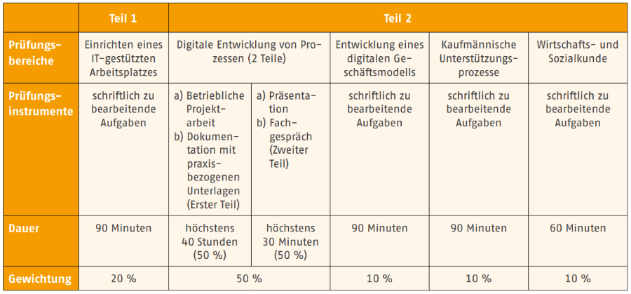
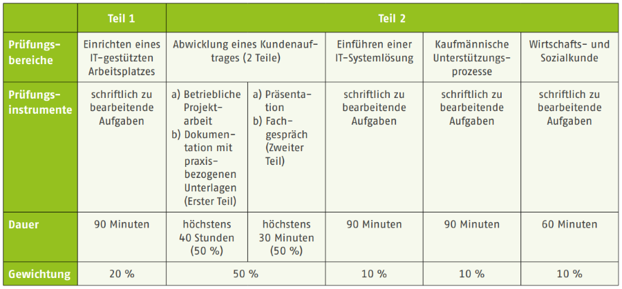

# Aufbau und Inhalt der IHK-Prüfung (AP1)

- Ablauf und Aufbau der AP1
- Bewertung der AP1
- Prüfungskatalog
- Themenübersichten vergangener Prüfungen

---

## Ablauf und Aufbau der AP1

Die AP1 ist die erste schriftliche IHK-Prüfung im Rahmen der gestreckten Abschlussprüfung der IT-Berufe. Alle IT-Berufe schreiben eine identische AP1. Die Bearbeitungsdauer beträgt 90 Minuten.

Das Thema der AP1 ist das Einrichten eines IT-gestützten Arbeitsplatzes. Die Prüfung dauert 90 Minuten und ist in Form von ungebundenen Aufgaben gestellt; also offene Fragen auf die Antwortsätze geschrieben oder Ergebnisse unter Angabe eines Rechenwegs ermittelt werden müssen.

Die Ausbildungsbetriebe melden ihre Auszubildenden für die AP1 bei der IHK an. Die Auszubildenden erhalten über den Betrieb eine Einladung zur Prüfung, welcher der Ort, die Zeit und weitere Details zu entnehmen sind.

Gemäß der Verordnung über die Berufsausbildung sind die Inhalte:

- Kundenbedarfe zielgruppengerecht ermitteln
- Hard- und Software auswählen und ihre Beschaffung einleiten
- Einen IT-Arbeitsplatz konfigurieren und testen sowie dabei die Bestimmungen und betrieblichen Vorgaben zum Datenschutz, zur IT-Sicherheit und zur Qualitätssicherung einhalten.
- Kundinnen in die Nutzung des Arbeitsplatzes einweisen
- Leistungserbringung kontrollieren und protokollieren

Die genauen Termine der AP1 veröffentlicht die IHK Hannover unter folgenden Link:

[IHK Hannover: Termine der AP1](https://www.ihk.de/hannover/hauptnavigation/ausbildung-und-weiterbildung/ausbildung/aktuell/termine-fuer-teil-1-der-ap-in-kaufmaennischen-berufen-5438396)

---

## Bewertung der AP1

Die Bewertung der AP1 erfolgt bei allen IT-Berufen mit 20% der IHK-Gesamtnote. Für die KDM sind die Prüfungsteile hier dargestellt:

*Bildquelle: BIBB Ausbildung gestalten - Kaufleute für Digitalisierungsmanagement (2020): S. , [LINK]()*

Die Bewertung der AP1 erfolgt bei allen IT-Berufen mit 20% der IHK-Gesamtnote. Für die KSM sind die Prüfungsteile hier dargestellt:

*Bildquelle: BIBB Ausbildung gestalten - Kaufleute für IT-System-Management (2020): S. , [LINK]()*

Die bisherigen Prüfungsergebnisse vergangener Prüfungen können unter folgendem Link in der Prüfungsstatistik der IHK abgerufen werden:

[Prüfungsstatistik der Industrie- und Handelskammer](https://pes.ihk.de/)

## 

