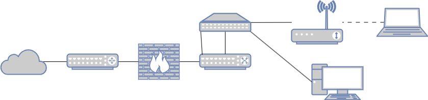

# Netzwerktechnik

## Grundkonzepte von Netzwerken beschreiben

### Arbeitsauftrag - Grundkonzepte von Netzwerken beschreiben

#### Aufgabe 1

Definieren Sie, was ein Netzwerk ist. Unterscheiden Sie hierzu zwischen Peer-to-Peer- und Client-Server-Verbindungen.

#### Aufgabe 2

Aus welchen Gründen werden Computer-Netzwerke eingerichtet?

#### Aufgabe 3

Nennen und beschreiben Sie typische Kopplungselemente (d.h. Hardware) für die Herstellung von Computer-Netzwerken. Suchen Sie jeweils ein Bild für einen Stellvertreter der Kategorie heraus.

#### Aufgabe 4

Welche Faktoren sind bei der Planung von Netzwerken bei einem Kunden zu berücksichtigen?

## Clients einem Netzwerk hinzufügen

### Arbeitsauftrag - Clients einem Netzwerk hinzufügen

#### Aufgabe 1

Welche Informationen muss ein kabelgebundener Netzwerk-Client wie bspw. ein Desktop-PC erhalten, um am Netzwerk teilnehmen zu können?

#### Aufgabe 2

Wenn in einem Netzwerk ein DHCP verfügbar ist, übernimmt dieser Aufgaben. Welche sind dies?

#### Aufgabe 3

Wie erhalte ich mit einem verbundenen Client Informationen zu den Netzwerk-Details. Unterscheiden Sie zwischen Windows- & Linux-Systemen.

#### Aufgabe 4

Wie lautet der Kommandozeilenbefehl, um die Anbindung an einen anderen Client im Netzwerk zu testen, wenn der Ziel-Client die IP-Adresse 192.168.178.2 hat?

#### Aufgabe 5

Welche IP-Adressbereiche kommen für private Netze in Frage?

## OSI-Modell nutzen

#### Aufgabe 1

Zeigen Sie den tabellarischen Aufbau des OSI-Referenz-Modells auf, indem Sie die Layer-Nr., den Namen auf englisch und deutsch sowie die Aufgaben der Schicht darstellen.

#### Aufgabe 2

Welche Ziele werden mit der Nutzung / Erläuterung von Netzwerken mithilfe des OSI-Referenz-Modells verfolgt?

#### Aufgabe 3

Beschreiben Sie die einzelnen Schichten nun etwas detaillierter. Was sind die Aufgaben, welche Pakete werden genutzt, welche Fehler könnten in dieser Schicht vorliegen?

## Wichtige Protokolle zuordnen

#### Aufgabe 1

Führen Sie die folgenden Protokolle tabellarisch auf. Ordnen Sie die OSI-Schicht, den ausgeschriebenen Namen sowie eine Beschreibung zu:

- DNS
- SMB
- NFS
- SMTP/S
- HTTP/S
- IPSEC
- IP
- TCP
- UDP
- SSH
- DHCP
- ARP
- TLS

#### Aufgabe 2

Welche Informationen sind zur Konfiguration eines E-Mail-Accounts in einem Client notwendig? Suchen Sie die Protokolle und Einstellungen zur Konfiguration Ihrer Schul-E-Mail-Adresse in einem Client heraus.

#### Aufgabe 3

Inwiefern unterscheiden sich die Protokolle HTTP und HTTPS voneinander? Erläutern Sie, wie die SSL Verschlüsselung funktioniert.

#### Aufgabe 4

Was genau ist HTTPS-Inspection? Welche Probleme können damit einher gehen?

## Netzwerkkomponenten unterscheiden

### Arbeitsauftrag - Netzwerkkomponenten unterscheiden

#### Aufgabe 1

Beschreiben Sie den Aufbau mithilfe von Netzwerk-Komponenten, die das Netzwerk in folgendem Beispiel abbilden. Welche teilweise auch nicht eingezeichneten/nicht explizit genannten Kopplungselemente werden für das Netzwerk benötigt?

#### Aufgabe 2

Welche Aufgabe hat ein Router? Machen Sie diese mithilfe eines Beispiels mit IP-Adressen Ihrer Wahl deutlich.

#### Aufgabe 3

Ein Server-Rack hat eine definierte Größe sowohl in der Höhe als auch in der Breite. In welchen Maßeinheiten werden diese angegeben?

#### Aufgabe 4

Für ein kleines Unternehmen wird diskutiert, ob ein managed oder unmanaged Switch eingesetzt werden sollte. Stellen Sie beide Varianten gegenüber und wägen Sie die Vor- und Nachteile ab.

## Verkabelung von Netzwerkkomponenten dimensionieren

### Arbeitsauftrag - Verkabelung von Netzwerkkomponenten dimensionieren

#### Aufgabe 1

Beschreiben Sie den primären, sekundären und tertiären Bereich der strukturierten Verkabelung für Netzwerke.

#### Aufgabe 2

Welche Kabeltypen werden für eine Netzwerkinfrastruktur benötigt? Beschreiben Sie diese kurz.

#### Aufgabe 3

Stellen Sie tabellarisch Kupferkabel einem Lichtwellenleiter gegenüber.

#### Aufgabe 4

Was gilt es bei der Herstellung von Netzwerken hinsichtlich der Verkabelung zu beachten?

## IPv4-Netzwerke planen

#### Aufgabe 1

Welche IPv4-Bereiche sind für private Netze definiert?

#### Aufgabe 2

## IPv6-Netzwerke planen
## VPN-Einsatz prüfen

#### Aufgabe 1

Definieren Sie in eigenen Worten, was VPN ist und wie dieses funktioniert?

#### Aufgabe 2

Unterscheiden Sie Site-to-Site sowie Client-to-Site im Zusammenhang von VPN.

#### Aufgabe 3

## WLAN planen

#### Aufgabe 1

Für die WLAN-Technik gibt es IEEE-Standards. Führen Sie die aktuell üblichen Standards tabellarisch auf und fügen Sie die maximalen Übertragungsraten sowie das Frequenz-Band hinzu.

#### Aufgabe 2

Welche Vorteile hat die Nutzung von WLAN?

#### Aufgabe 3

Welche Nachteile gehen mit der Nutzung von WLAN einher?

#### Aufgabe 4

Definieren Sie, was eine SSID ist.

#### Aufgabe 5

Welche aktuellen WLAN-Verschlüsselungsmethoden werden genutzt? Wie unterscheiden sich diese?

#### Aufgabe 6

Unterscheiden Sie die Funktionsweise eines Repeaters von der eines Access-Points.

