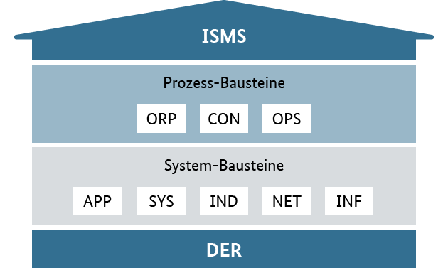

# IT-Sicherheit

## Grundlagen der Informationssicherheit anwenden

### Arbeitsauftrag - Dimensionen der Informationssicherheit unterscheiden

#### Aufgabe 1

Beschreiben Sie das Schutzziel "Vertraulichkeit" in eigenen Worten und geben Sie ein Beispiel.

#### Aufgabe 2

Beschreiben Sie das Schutzziel "Integrität" in eigenen Worten und geben Sie ein Beispiel.

#### Aufgabe 3

Beschreiben Sie das Schutzziel "Verfügbarkeit" in eigenen Worten und geben Sie ein Beispiel.

#### Aufgabe 4

Der Außendienst einer großen Handelskette hat als Endgerät ein Convertable-Laptop aus der Business-Serie eines weit verbreiteten  Herstellers erhalten. Dieses wird bei allen Dienstreisen mit dem dem Auto oder auch mit der Bahn mitgeführt.

Beschreiben Sie anhand des Beispiels jeweils zwei notwendige Aktionen seitens der IT-Abteilung der Handelskette aus der Perspektive der Administration, um die drei Schutzziele der Informationssicherheit einzuhalten.

### Arbeitsauftrag - Angriffsszenarien einordnen

#### Aufgabe 1

Beschreiben Sie jeweils die Bedrohung durch ...

- Viren
- Würmer
- Trojaner
- Ransomware
- Phishing
- Spoofing
- Spam
- Spyware
- Adware
- DDoS-Attacken
- APT-Attacken

#### Aufgabe 2

Ransomware hat sich in den letzten Jahren als große Herausforderung für die IT-Abteilungen aller Branchen herausgestellt. Beschreiben Sie den üblichen Ablauf einer Ransomware-Attacke auf ein Unternehmen.

#### Aufgabe 3

Welche Handlungen sind bei einer Betroffenheit durch eine Ransomware-Attacke zu ergreifen? Machen Sie deutlich, wenn es sich bei den Handlungen um rechtlich vorgeschriebene Schritte handelt.

#### Aufgabe 4

Welche Handlungen sind in einer IT-Abteilung angebracht, um auf eine Ransomware-Attacke vorbereitet zu sein und diese möglichst abzumildern?

#### Aufgabe 5

Beschreiben Sie den Ablauf einer DDoS-Attacke und zeigen Sie Handlungsoptionen auf, wie diesem Angriff begegnet werden kann.

## IT-Grundschutz planen

### Arbeitsauftrag - IT-Grundschutz planen

#### Aufgabe 1

Welche Norm betrifft die Gewährleistung der IT-Sicherheit und den Aufbau eines IT-Sicherheitsmanagementsystems? Beschreiben Sie kurz den Inhalt der Norm(-enfamilie).

#### Aufgabe 2

Im Sinne der kontinuierlichen Verbesserung wird der PDCA-Zyklus auf ein IT-Sicherheitssystem angewendet. Beschreiben Sie die einzelnen Schritte anhand eines Beispielfalls.

#### Aufgabe 3

Die Bausteine des IT-Grundschutzes sind gemäß BSI in das folgende Schichtenmodell gegliedert:

*Bildquelle: https://www.bsi.bund.de/SharedDocs/Bilder/DE/BSI/Themen/grundschutzdeutsch/Webkurs2018/Abb_5_02_Schichtenmodell.png?__blob=normal&v=1*

Beschreiben Sie kurz, was hinter den Bausteinen steht.

#### Aufgabe 4

Im Rahmen eines Projektes beschaffen Sie ein NAS, um einen zentralen Datenspeicher für die Vertriebsabteilung einzurichten. Auf diesem Datenspeicher werden sowohl Produktbezogene Dateien wie Anleitungen und Produktdatenblätter, als auch die Anfragen von Interessenten, Geschäftsbriefe mit Kunden und Informationen der Außendienstmitarbeiter zu Kundenbesuchen gespeichert werden.

Sie möchten hierzu eine Schutzbedarfs- und Risikoanalyse durchführen und sich im IT-Grundschutz-Kompendium informieren. Welches Vorgehen ist dafür notwendig.

#### Aufgabe 5

Nach BSI-Standard werden die Schutzbedarfskategorien "niedrig", "normal", "hoch" und "sehr hoch" unterschieden. Beschreiben Sie diese Stufen und geben Sie jeweils ein Beispiel. 

## DSGVO-konform handeln

### Arbeitsauftrag - DSGVO-konform handeln

#### Aufgabe 1

Definieren Sie, was personenbezogene Daten sind.

#### Aufgabe 2

Worin unterscheiden sich personenbezogene Daten und besonders schützenswerte personenbezogene Daten?

#### Aufgabe 3

Ein Mitarbeiter eines Personaldienstleisters tätigt im Rahmen eines Vortrags auf einer Jobmesse folgende Aussage: "Wir können das durchschnittliche Gehalt unserer Mitarbeitergruppe der IT-System-Kaufleute an dieser Stelle aus datenschutzgründen nicht nennen."

Nehmen Sie Stellung zu der Aussage.

#### Aufgabe 4

Als Kunde eines Onlineshops werden Daten gespeichert. Nennen Sie die Rechte der Betroffenen.

#### Aufgabe 5

Im Falle eines DSGVO-Verstoßes oder auch im Falle eines Cyberangriffs mit Erbeutung von Kundendaten ergeben sich für das hiervon betroffene Unternehmen Verpflichtungen. Welche sind dies?

#### Aufgabe 6

Unterscheiden Sie identifizierbare Daten, pseudonomysierte Daten sowie anonyme Daten von Personen.

## Abwehr von Angriffen planen

### Arbeitsauftrag - Abwehr von Angriffen planen

#### Aufgabe 1

Beschreiben Sie die Funktionsweise eines Antiviren-Programms auf einem Client.

#### Aufgabe 2

Beschreiben Sie die Funktionsweise einer portbasierten Firewall.

#### Aufgabe 3

Beschreiben Sie die Funktionsweise einer Firewall mit Deep-Packet-Inspection.

## Grundlagen der Computersicherheit einhalten

### Arbeitsauftrag - Grundlagen der Computersicherheit einhalten

#### Aufgabe 1

Nennen Sie Merkmale eines sicheren Passwortes.

#### Aufgabe 2

Beschreiben Sie, was unter 2-Faktor-Authentifizierung zu verstehen ist. Machen Sie dabei im Detail deutlich, was die zwei Faktoren sind.

#### Aufgabe 3

Beschreiben Sie den technischen Ablauf zur Einrichtung und Nutzung einer 2FA mithilfe von TOTP.

### Arbeitsauftrag - Technisch-organisatorische Maßnahmen anwenden

#### Aufgabe 1

Was ist unter technisch-organisatorischen Maßnahmen zu verstehen?

#### Aufgabe 2

Sie arbeiten in einem Unternehmen, welches einen eigenen Serverraum für On-Premise Dienste betreibt. Beschreiben Sie an diesem Beispiel, welche technisch-organisatorischen Maßnahmen ergriffen werden können, um eine sichere Umgebung zum Betrieb des Servers zu gewährleisten.

