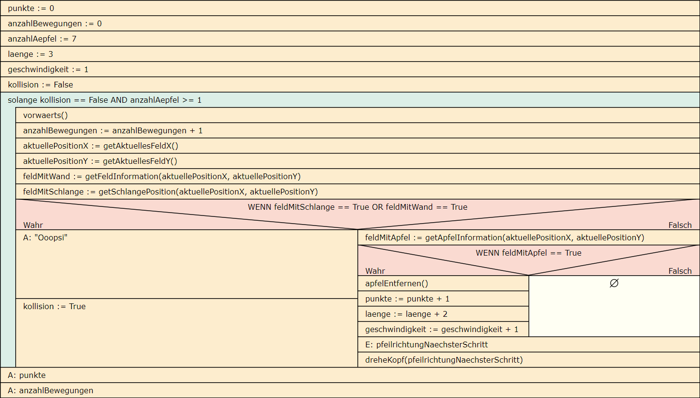

# Anwendungsentwicklung

## UML-Anwendungsfalldiagramme erstellen

#### Aufgabe 1

Welche Aufgabe kommt dem UML-Anwendungsfalldiagramm im Rahmen der objektorientierten Programmierung (OOP) zu?

#### Aufgabe 2

Beschreiben Sie die einzelnen Bausteine/Elemente, die in einem UML-Anwendungsfalldiagramm verwendet werden können.

- Akteur
- Systemgrenze
- Anwendungsfall
- Beziehung
  - include-Beziehung
  - extend-Beziehung

#### Aufgabe 3

Ihnen ist das folgende UML-Anwendungsfalldiagramm gegeben. Formulieren Sie aus den Anwendungsfallen (Use-Cases) mindestens drei User-Stories.


#### Aufgabe 4

Erstellen Sie das UML-Anwendungsfalldiagramm zu dem im Folgenden beschriebenen Online-Ticket-Verkauf:

Das UML-Anwendungsfalldiagramm für den Online-Ticket-Verkauf repräsentiert die Interaktionen zwischen verschiedenen Akteuren und den definierten Anwendungsfällen. Die Hauptakteure in diesem System sind normalerweise der Kunde, der Veranstalter und das Ticket-System selbst. Die Anwendungsfälle stellen die verschiedenen Funktionen dar, die das System den Benutzern zur Verfügung stellt.

- Kunde:
  - Anmelden: Der Kunde kann sich im System anmelden, um personalisierte Funktionen wie den Zugriff auf die Bestellhistorie und spezielle Angebote abzurufen.
  - Tickets durchsuchen: Der Kunde kann nach seiner Anmeldung nach verfügbaren Veranstaltungen und Tickets suchen, indem er Filter und Suchkriterien anwendet.
  - Ticket kaufen: Der Kunde kann nach Anmeldung am System Tickets für eine ausgewählte Veranstaltung kaufen.
- Veranstalter:
  - Veranstaltung erstellen: Der Veranstalter kann eine neue Veranstaltung mit relevanten Informationen wie Name, Datum, Ort usw. erstellen.
  - Tickettypen festlegen: Der Veranstalter kann verschiedene Tickettypen für eine Veranstaltung definieren, z.B. reguläre Tickets, VIP-Tickets usw.
  - Verkaufsberichte einsehen: Der Veranstalter kann Berichte über den Ticketverkauf für seine Veranstaltungen einsehen.
- Ticket-System:
  - Bestellungsverwaltung: Das System ermöglicht die Verwaltung von Bestellungen, einschließlich Stornierungen, Bestellhistorie und Zahlungsinformationen.
  - Verfügbarkeit prüfen: Das System überprüft die Verfügbarkeit von Tickets für eine bestimmte Veranstaltung. Wenn der Kunde nach Tickets sucht, wird dieser Anwendungsfall immer mit einbezogen.
  - Benachrichtigungen senden: Das System kann automatische Benachrichtigungen an Kunden und Veranstalter senden, z.B. Bestätigungsmails und E-Tickets.

## UML-Klassendiagramme erstellen

### Arbeitsauftrag - UML-Klassendiagramme erstellen

#### Aufgabe 1

Was ist eine Klasse im Sinne der objektorientieren Programmierung (OOP)?

#### Aufgabe 2

Was ist Vererbung im Sinne der objektorientieren Programmierung (OOP)?

#### Aufgabe 3

Beschreiben Sie im Zusammenhang mit der Vererbung von Klassen, was mit Generalisierung bzw. Spezialisierung gemeint ist.

#### Aufgabe 4

Was ist Polymorphie im Sinne der objektorientieren Programmierung (OOP)?

#### Aufgabe 5

Erstellen Sie das UML-Klassendiagramm zu folgendem Fall:

*Es soll für einen Onlineshop für Klemmbausteine eine Anwendung zum Angebot von Ersatzteilen erstellt werden. Von jedem Klemmbaustein wird die Bezeichnung, die Farbe und die Anzahl der Noppen gespeichert. Es gibt unter anderem folgende Arten von Klemmbausteinen: Basissteine, Konstruktionssteine, Tiere und Menschen. Bei einem Basissteinen wird gespeichert, ob dieser zum Hersteller* Lego *kompatibel ist, bei jedem Mensch wird gespeichert, ob er/sie den Kopf drehen kann oder nicht. Bei den Tieren wird gespeichert, ob obendrauf ein Mensch oder ein weiteres Tier reiten kann. Es gibt genau zwei Arten von Konstruktionssteinen, Schienen – von ihnen wird die Länge gespeichert – und Platten, von denen Länge und Breite gespeichert werden.*

## Struktogramme zur Planung von Anwendungen nutzen

### Arbeitsauftrag - Struktogramme erstellen

#### Aufgabe 1

Beschreiben Sie in eigenen Worten alle Elemente, die in einem Struktogramm verwendet werden können. Sie können sich die Bausteine des Struktogramms im hier empfohlenen Editor [Struktog.](https://dditools.inf.tu-dresden.de/struktog/index.html) ansehen.

- Anweisungen
  - Eingabe
  - Ausgabe
  - Standardanweisung
- Schleifen
  - Zählergesteuerte Schleife
  - Kopfgesteuerte Schleife
  - Fußgesteuerte Schleife
- Kontrollstrukturen
  - Verzweigung
  - Fallunterscheidung
  - Try-Catch
- Funktionen

#### Aufgabe 2

Struktogramme werden für die Planung von Programmlogiken verwendet. Beschreiben Sie das Ziel in der Verwendung in eigenen Worten und nennen Sie Vor- und Nachteile dieser Notationsform.

#### Aufgabe 3

Ihnen liegt das folgende Python-Script vor. Erstellen Sie das hierzu passende Struktogramm:

``` python
# Struktogramm-Beispiel in Python

# Ein- und Ausgabe
name = input("Gib deinen Namen ein: ")
print("Hallo, " + name + "!")

# Verzweigung (if-Anweisung)
alter = int(input("Gib dein Alter ein: "))
if alter >= 18:
    print("Du bist volljährig.")
else:
    print("Du bist minderjährig.")

# Schleife (while-Schleife)
zahl = 1
while zahl <= 5:
    print(zahl)
    zahl += 1

# Schleife (for-Schleife)
for i in range(3):
    print("Schleifendurchlauf: " + str(i))

# Funktion
def quadrat(x):
    return x * x

# Funktionsaufruf
ergebnis = quadrat(4)
print("Das Quadrat von 4 ist: " + str(ergebnis))
```

#### Aufgabe 4

In einer Softwaresammlung eines Kollegen finden Sie das folgende PowerShell-Script. Erstellen Sie auch hierzu das passende Struktogramm:

``` powershell
# PowerShell-Beispiel: Erweiterter Datei-Scan und Ausgabe

# Ein- und Ausgabe
$verzeichnis = Read-Host "Gib das Verzeichnis ein: "
Write-Host "Das ausgewählte Verzeichnis ist: $verzeichnis"

# Verzweigung (if-Anweisung)
if (Test-Path $verzeichnis) {
    Write-Host "Das Verzeichnis existiert."
} else {
    Write-Host "Das Verzeichnis existiert nicht."
    return
}

# Schleife (while-Schleife)
$zahl = 1
while ($zahl -le 3) {
    Write-Host "Schleifendurchlauf: $zahl"
    $zahl++
}

# Alle Dateien im Verzeichnis auflisten
$dateien = Get-ChildItem -Path $verzeichnis

# Schleife (foreach-Schleife)
foreach ($datei in $dateien) {
    Write-Host "Datei: $($datei.FullName)"

    # Inhalt der Textdateien ausgeben
    if ($datei.Extension -eq ".txt") {
        $inhalt = Get-Content -Path $datei.FullName
        Write-Host "Inhalt:"
        Write-Host $inhalt
    }

    # Verzweigung (switch-Anweisung)
    switch ($datei.Extension) {
        ".txt" { Write-Host "Dies ist eine Textdatei." }
        ".csv" { Write-Host "Dies ist eine CSV-Datei." }
        default { Write-Host "Dateityp nicht erkannt." }
    }

    Write-Host "------------------------"
}

# Funktion
function Quadrat($x) {
    return $x * $x
}

# Funktionsaufruf
$ergebnis = Quadrat -x 4
Write-Host "Das Quadrat von 4 ist: $ergebnis"
```

#### Aufgabe 5

Die Bücherei eines Dorfes in der Nähe von Hannover arbeitet bisher zur Verwaltung des Bestandes sowie der Ausleihvorgänge mit einer Excel-Tabelle. Eine neue Anwendung soll hierfür geschrieben werden. Aus den ersten Gesprächen mit dem Bücherei-Team haben sich folgende Beschreibungen zur gewünschten Funktionalität des Programms ergeben:

##### Programmbeschreibung: Bibliotheksverwaltung

1. Initialisierung:
   - Das Programm startet und initialisiert eine leere Liste für die Buchdatenbank.
2. Hauptmenü:
   - Das Hauptmenü wird angezeigt:
      - Option 1: Buch hinzufügen
      - Option 2: Buch suchen
      - Option 3: Alle Bücher anzeigen
      - Option 4: Programm beenden
3. Buch hinzufügen:
   - Der Benutzer wählt Option 1:
      - Eingabe des Buchtitels, Autors und Erscheinungsjahrs.
      - Überprüfe, ob das Buch bereits in der Datenbank existiert.
         - Falls ja, gib eine Warnung aus und kehre zum Hauptmenü zurück.
         - Falls nein, füge das Buch zur Datenbank hinzu.
4. Buch suchen:
   - Der Benutzer wählt Option 2:
      - Eingabe des Buchtitels oder Autors.
      - Suche in der Datenbank nach Übereinstimmungen und gib die Ergebnisse aus.
      - Falls keine Übereinstimmung gefunden wurde, gib eine entsprechende Meldung aus.
5. Alle Bücher anzeigen:
   - Der Benutzer wählt Option 3:
      - Zeige alle Bücher in der Datenbank an, sortiert nach dem Erscheinungsjahr.
6. Programm beenden:
   - Der Benutzer wählt Option 4:
      - Beende das Programm.
7. Hauptschleife:
   - Nach jeder abgeschlossenen Aktion kehre zum Hauptmenü zurück.
   - Die Benutzer können das Programm beenden, indem sie Option 4 auswählen.

### Arbeitsauftrag - Struktogramme mithilfe des Schreibtischtests prüfen

#### Aufgabe 1

Beschreiben Sie den Ablauf eines Schreibtischtests zur Prüfung von Struktogrammen im Allgemeinen.

#### Aufgabe 2

Sie haben ein Browsergame auf Ihrer Webseite implementiert. Einen User haben Sie eine Runde spielen lassen. Hieraus leiten Sie die Eingaben zur Kontrolle mit dem Struktogramm ab.

Das Spiel "Schlange" wird durch folgendes Spielfeld beschrieben:


- Die roten Felder sind "Äpfel", die es aufzusammeln gilt.
- Das orangene Feld ist der Kopf der Schlange. Diese kann sich nur nach vorne bewegen, wird aber in der Richtung (vorwärts, links, rechts) durch den User gesteuert.
- Die gelben Felder sind der Körper der Schlange.
- Wenn ein Apfel gefressen wurde:
  - Der Spieler erhält einen Punkt.
  - Außerdem verlängert sich die Schlange um zwei gelbe Felder und wird eine Geschwindigkeitsstufe schneller.
  - Die Bewegung findet aber dennoch Feld für Feld statt und kann für jedes nächste Feld gesteuert werden.
  - Der Apfel wird vom Spielfeld entfernt.
- Wenn der User keine Eingabe der Richtung vorgibt, wird automatisch vorwärts gewählt.
- Das Spiel endet sofort, wenn durch einen Schritt Vorwärts die Wand oder ein Teil der Schlange selbst  betreten wird.
- Wurde ein Hindernis getroffen, wird "Ooopsi" ausgegeben und die Kollisionserkennung ausgelöst.
- Nach Ende des Spiels wird der Punktestand sowie die Anzahl der Bewegungen auf den Feldern ausgegeben.
- Die Funktion getAktuellesFeldX() ermittelt die aktuelle Position auf der X-Achse. Die Schlange startet in dem Beispiel auf `20`.
- Die Funktion getAktuellesFeldY() ermittelt die aktuelle Position auf der Y-Achse. Die Schlange startet in dem Beispiel auf `K`.
- Die Funktion `getFeldInformationen(aktuellePositionX, aktuellePositionY)` erhält zwei Übergabeparameter in der Form `X-Wert, Y-Wert`. Der Rückgabewert der Funktion ist `False`, wenn das Feld frei ist. Wenn das Feld eine Wand enthält ist der Rückgabewert `True`.
- Die Funktion `getSchlangePosition(aktuellePositionX, aktuellePositionY)` erhält zwei Übergabeparameter in der Form `X-Wert, Y-Wert`. Der Rückgabewert der Funktion ist False, wenn das Feld frei ist. Wenn das `Feld` einen Teil der Schlange enthält ist der Rückgabewert `True`.
- Die Funktion `getApfelInformation(aktuellePositionX, aktuellePositionY)` erhält zwei Übergabeparameter in der Form `X-Wert, Y-Wert`. Der Rückgabewert der Funktion ist False, wenn das Feld frei ist. Wenn das `Feld` einen Apfel enthält ist der Rückgabewert `True`.
- Die Funktion `apfelEntfernen()` sorgt lediglich dafür, dass auf dem Spielfeld ein gefressener Apfel nicht mehr angezeigt wird.

Das Struktogramm liegt Ihnen vor:



Die User-Eingaben für den Test waren:

- Vorwärts
- Vorwärts
- Danach hat der User das Programm bei dreheKopf(pfeilrichtungNaechsterSchritt) beendet.

1. Führen Sie den Schreibtischtest dieser Spiel-Runde durch.
2. Beschreiben Sie den Ablauf der Test-Spielrunde durch den User in eigenen Worten.
3. Welche zwei Fehler hinsichtlich der Programm-/Spiel-Logik sind im Struktogramm enthalten?

