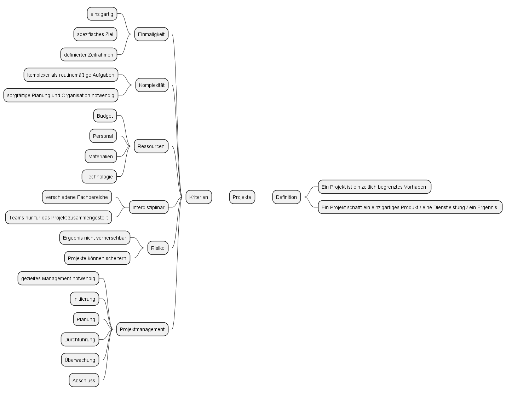
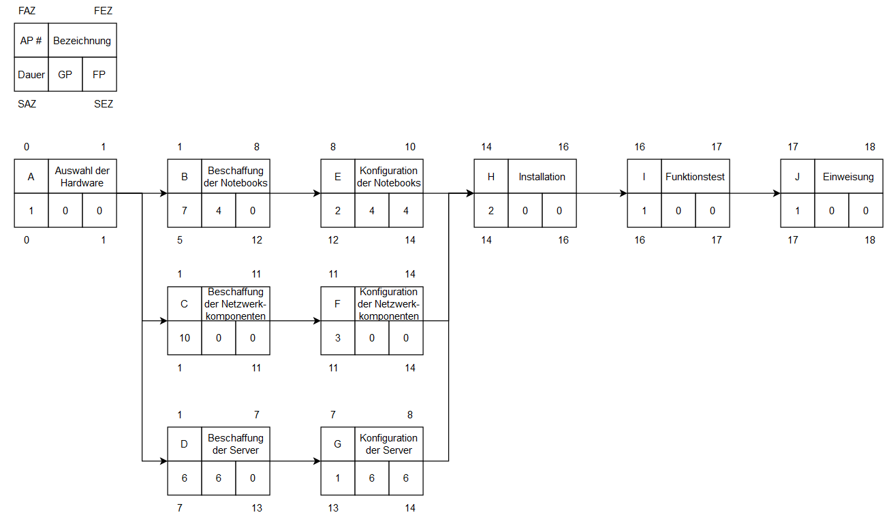
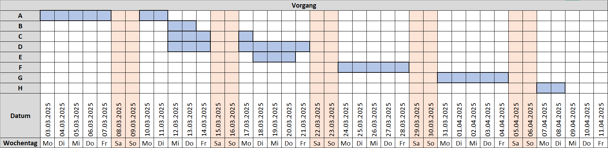

# Lösungshinweise zum Projektmanagement (div. LF)

## Lösungshinweise zum Arbeitsauftrag - Projekte definieren

### Aufgabe 1

### Aufgabe 2

PRINCE2 (Projects IN Controlled Environments) ist eine strukturierte Projektmanagementmethode, die darauf abzielt, den Erfolg von Projekten sicherzustellen. Es handelt sich um eine prozessorientierte Methode, die auf bewährten Praktiken basiert und eine klare Rollen- und Verantwortungsverteilung innerhalb des Projektteams fördert. PRINCE2 besteht aus sieben Prinzipien, sieben Themen und sieben Prozessen, die in jeder Projektphase angewendet werden. Die Methode bietet einen flexiblen Rahmen, der es ermöglicht, Projekte unabhängig von ihrer Größe und Komplexität erfolgreich zu managen. PRINCE2 unterstützt eine effiziente Kommunikation zwischen den Projektbeteiligten und ermöglicht es, Risiken frühzeitig zu erkennen und zu bewältigen.

### Aufgabe 3

1. Projektvorbereitung: Projektmandat oder Projektantrag
2. Projektinitialisierung: Projektauftrag, Business Case, Projektstrukturplan (PSP)
3. Projektplanung: Projektplan, Risikomanagementplan, Qualitätsmanagementplan
4. Projektsteuerung: Fortschrittsberichte, Änderungsanträge, Meilensteinprotokolle
5. Projektabschluss: Projektabschlussbericht, Lessons Learned-Dokumentation, Freigabe des Projektteams

je nach Lehrwerk auch möglich

1. Initialisierung
2. Definition
3. Planung
4. Steuerung/Überwachung
5. Abschluss

oder Vier-Phasen-Modell:

1. Projektdefinition
2. Projektplanung
3. Projektdurchführung und Steuerung
4. Projektabschluss

### Aufgabe 4

Die Stakeholder in einem Projekt in einem Unternehmen sind Personen oder Gruppen, die direkt oder indirekt vom Projekt betroffen sind, Einfluss darauf haben oder ein Interesse daran haben.

- **Auftraggeber/Projektsponsor:** Die Person oder Gruppe, die das Projekt initiiert und die finanzielle Unterstützung bereitstellt.
- **Projektmanager:** Die Person, die für die Planung, Durchführung und Überwachung des Projekts verantwortlich ist.
- **Projektteam:** Die Mitglieder, die direkt an der Umsetzung des Projekts arbeiten und ihre spezifischen Aufgaben haben.
- **Fachexperten und Ressourcenverantwortliche:** Personen oder Gruppen, die spezifische Kenntnisse und Ressourcen in das Projekt einbringen.
- **Kunden:** Diejenigen, die das Endprodukt oder die Dienstleistung nutzen werden.
- **Lieferanten und Partner:** Externe Unternehmen oder Organisationen, die zur Erreichung des Projektziels beitragen.
- **Interessengruppen (Stakeholder) aus dem Unternehmen:** Andere Abteilungen, die von den Ergebnissen des Projekts betroffen sein könnten.
- **Endanwender:** Personen, die das fertige Produkt oder die Dienstleistung nutzen werden.
- **Öffentlichkeit und Regulierungsbehörden:** Externe Stakeholder, die durch das Projekt betroffen sein könnten. Bspw. bei dem Neubau einer Produktionshalle die umliegenden Nachbarn des Grundstücks.

## Lösungshinweise zum Arbeitsauftrag - Netzpläne erstellen

### Aufgabe 1

### Aufgabe 2

A > C > F > H > I > J

Der Pfad auf dem keine Puffer existieren.

### Aufgabe 3

- **Freier Puffer:** Der freie Puffer (auch als Float oder Slack bezeichnet) ist die Zeit, um die eine Aktivität verzögert werden kann, ohne nachfolgende Arbeitspakete/Aktivitäten sowie die Gesamtdauer zu beeinflussen. Er zeigt an, wie flexibel eine Aktivität innerhalb des Zeitplans verschoben werden kann, ohne die nachfolgenden Aktivitäten zeitlich zu beeinträchtigen.
- **Gesamtpuffer:** Der Gesamtpuffer ist die maximale Verzögerung, die in einem Pfad auftreten kann, ohne die Projektdauer insgesamt zu verlängern. Er bezieht sich auf den kritischen Pfad im Projekt und zeigt die Zeitreserve, die im Projekt vorhanden ist, bevor sich die Gesamtdauer ändert.

### Aufgabe 4

Wenn der Lieferant die Server erst 8 Tage später liefern kann, wird dies zu einer Verzögerung der Aktivitäten führen, die von dieser Lieferung abhängen. Insbesondere wird es Auswirkungen auf die nachfolgenden Aktivitäten im Projekt haben, die von der Installation der Server abhängig sind. Dadurch kann der kritische Pfad verlängert werden, was zu einer Verlängerung der geplanten Projektdauer führt.

### Aufgabe 5

Um trotz einer relevanten Verschiebung des Projektfinales nach hinten das ursprüngliche Projektende zu erreichen, kann der Projektleiter verschiedene Maßnahmen ergreifen:

- **Ressourcenoptimierung:** Der Projektleiter kann zusätzliche Ressourcen zu kritischen Aktivitäten zuweisen, um ihre Bearbeitungszeit zu verkürzen.
- **Parallelisierung:** Aktivitäten, die nicht zwingend sequenziell abhängig sind, können parallel ausgeführt werden, um die Gesamtdauer zu verkürzen.
- **Priorisierung:** Der Fokus kann auf kritischen Aktivitäten erhöht werden, um sicherzustellen, dass sie pünktlich abgeschlossen werden.
- **Puffer nutzen:** Zusätzliche Zeitpuffer, die vorab eingeplant wurden, können aufgebraucht werden, um unvorhergesehene Verzögerungen abzufedern.
- **Zusätzliche Ressourcen:** Temporäre zusätzliche Ressourcen könnten in kritische Aktivitäten investiert werden, um sie schneller abzuschließen. Hierzu zählen bisher noch nicht im Projekt befindliche Mitarbeiter, das Outsourcing von Aktivitäten an andere Unternehmen oder auch Überstunden der Projektmitarbeiter.
- **Reduzierung von Umfang oder Qualität:** Der Projektleiter könnte den Projektumfang reduzieren oder Qualitätsziele anpassen, um das Projektende zu beschleunigen.

## Lösungshinweise zum Arbeitsauftrag - Gantt-Diagramme erstellen

### Aufgabe 1

### Aufgabe 2

A -> D -> F -> G -> H

### Aufgabe 3

Vorteile des Gantt-Diagramms gegenüber dem Netzplan:

- **Einfachheit:** Gantt-Diagramme sind einfach zu erstellen und zu verstehen. Sie verwenden Balken, um Aktivitäten und deren Zeitplan darzustellen, was die Visualisierung des Projektplans erleichtert.
- **Übersichtlichkeit:** Gantt-Diagramme bieten eine klare und übersichtliche Darstellung der Projektzeitplanung, einschließlich der Dauer und Reihenfolge der Vorgänge.
- **Intuitive Planung:** Die Anordnung der Balken im Gantt-Diagramm zeigt visuell, wie die Vorgänge zeitlich aufeinanderfolgen und wie sie sich überschneiden können.
- **Kommunikation:** Gantt-Diagramme sind effektive Kommunikationsmittel, da sie Kunden, Stakeholdern und Teammitgliedern einen schnellen Überblick über den Projektfortschritt geben.

### Aufgabe 4

Nachteile des Gantt-Diagramms gegenüber dem Netzplan:

- **Mangelnde Details:** Gantt-Diagramme bieten weniger detaillierte Informationen über die Abhängigkeiten zwischen den Vorgängen im Vergleich zum Netzplan (auch als PERT- oder CPM-Diagramm bezeichnet).
- **Schwierige Änderungen:** Wenn sich die Projektpläne ändern, kann das Aktualisieren des Gantt-Diagramms zeitaufwändig und schwierig sein, besonders bei komplexen Projekten.
- **Keine Ressourcenplanung:** Das Gantt-Diagramm zeigt zwar den zeitlichen Ablauf der Vorgänge, aber es berücksichtigt keine Ressourcenverfügbarkeit und -auslastung.
- **Begrenzte Visualisierung von Abhängigkeiten:** Im Gantt-Diagramm werden Abhängigkeiten zwischen den Vorgängen nicht so deutlich dargestellt wie im Netzplan, wo Pfeile die Beziehungen zeigen.
- **Keine kritische Pfad-Analyse:** Während der kritische Pfad im Gantt-Diagramm identifiziert werden kann, bietet es keine automatische Berechnung von Pufferzeiten oder -pfaden wie der Netzplan.

## Lösungshinweise zum Arbeitsauftrag - Anforderungen erheben

### Aufgabe 1

**Funktionale Anforderungen** beschreiben, was ein System oder Produkt tun soll, welche Funktionen es haben muss und welche Aktionen es ausführen kann. Sie sind konkret, messbar und können in der Regel mit "muss", "soll", "ist in der Lage zu" usw. formuliert werden. Funktionalen Anforderungen liegt eine klare Spezifikation zugrunde, die das Verhalten des Systems oder Produkts beschreibt. Beispiele für funktionale Anforderungen wären: "Das System muss in der Lage sein, Benutzer anzumelden".

**Nicht-funktionale Anforderungen** hingegen beschreiben die Qualitätsmerkmale und Einschränkungen, die das System oder Produkt erfüllen muss, ohne spezifische Funktionen zu beschreiben. Sie betreffen Eigenschaften wie Leistung, Sicherheit, Benutzerfreundlichkeit, Skalierbarkeit, Zuverlässigkeit usw. Diese Anforderungen sind oft nicht direkt messbar, sondern eher beschreibend. Beispiele für nicht-funktionale Anforderungen wären: "Das System muss eine Reaktionszeit von unter 2 Sekunden haben" oder "Das Produkt soll den ISO 9001-Qualitätsstandard erfüllen".

### Aufgabe 2

Anforderungen können im Unternehmensumfeld auf verschiedene Arten generiert werden:

- **Interviews und Workshops:** Direkte Gespräche mit den Stakeholdern, Benutzern und Fachexperten können wertvolle Informationen über die Anforderungen liefern.
- **Umfragen und Fragebögen:** Schriftliche Befragungen ermöglichen es, eine größere Anzahl von Stakeholdern einzubeziehen und deren Meinungen und Bedürfnisse zu sammeln.
- **Beobachtung:** Durch Beobachtung der Arbeitsabläufe und Interaktionen können Anforderungen besser verstanden und identifiziert werden.
- **Benchmarking:** Der Vergleich mit ähnlichen Projekten oder Produkten kann wertvolle Erkenntnisse über die Anforderungen liefern.
- **Prototyping:** Durch das Erstellen von Prototypen können Benutzerfeedback und Anforderungen iterativ gesammelt und verbessert werden.
- **Dokumentenanalyse:** Bestehende Dokumentationen wie Geschäftsprozessdokumente oder technische Spezifikationen können Anforderungen enthalten.

### Aufgabe 3

Eine formulierte Anforderung sollte folgenden Gütekriterien genügen:

- **Eindeutigkeit:** Die Anforderung sollte klar und präzise formuliert sein, ohne Interpretationsspielraum.
- **Vollständigkeit:** Alle relevanten Informationen sollten in der Anforderung enthalten sein, um Missverständnisse zu vermeiden.
- **Nachvollziehbarkeit:** Die Anforderung sollte verfolgbar sein, sodass ihre Herkunft und ihre Auswirkungen nachvollzogen werden können.
- **Konsistenz:** Die Anforderung sollte sich nicht widersprechen und mit anderen Anforderungen und Zielen des Projekts übereinstimmen.
- **Realisierbarkeit:** Die Anforderung sollte technisch, wirtschaftlich und zeitlich umsetzbar sein.
- **Testbarkeit:** Die Anforderung sollte überprüfbar sein, um sicherzustellen, dass sie erfüllt wurde.

### Aufgabe 4

Eine **User Story** ist eine kurze, informelle Beschreibung einer Funktion oder Anforderung aus der Sicht des Endbenutzers. Sie folgt einer spezifischen Vorlage: "Als [Rolle] möchte ich [Aktivität], damit [Nutzen]". Zum Beispiel: "Als Kunde möchte ich mich in meinem Konto anmelden, damit ich meine Bestellungen verfolgen kann."

Eine User Story ist ein wichtiges Werkzeug im agilen Projektmanagement, insbesondere in der Methode Scrum. Sie hilft dabei, die Anforderungen aus der Perspektive der Benutzer zu verstehen und zu priorisieren. User Stories werden typischerweise auf Karteikarten oder im elektronischen Format in einer Produkt-Backlog-Liste gespeichert.

Der Zusammenhang zum **UML Use-Case-Diagramm** besteht darin, dass beide Techniken dazu dienen, Anforderungen zu dokumentieren und zu visualisieren. Im Use-Case-Diagramm werden die Interaktionen zwischen Akteuren (Benutzern) und dem System durch Use Cases (Anwendungsfälle) dargestellt. Eine User Story kann als informale Beschreibung eines solchen Use Cases betrachtet werden. User Stories ergänzen das Use-Case-Diagramm und bieten eine weniger formale, benutzerorientierte Sichtweise auf die Anforderungen. In agilen Projekten können User Stories in User Story Maps verwendet werden, um die Priorisierung und Planung von Funktionen zu unterstützen.

## Lösungshinweise zum Arbeitsauftrag - Lasten- und Pflichtenheft unterscheiden

### Aufgabe 1

Ein Lastenheft ist ein Dokument, das die Anforderungen und Erwartungen an ein Projekt, ein Produkt oder eine Dienstleistung aus Sicht des Auftraggebers oder Kunden beschreibt. Es dient als Grundlage für die Zusammenarbeit zwischen dem Auftraggeber und dem Auftragnehmer, da es die Bedürfnisse, Ziele und Anforderungen des Kunden klar und umfassend festhält. Das Lastenheft legt die Rahmenbedingungen für das Vorhaben fest und dient als Ausgangspunkt für die Erstellung eines Angebots oder einer Lösung durch den Auftragnehmer.

Das Lastenheft wird in der Regel vom Auftraggeber oder Kunden erstellt. Die Motivation hierfür besteht darin, sicherzustellen, dass die eigenen Anforderungen und Erwartungen an das Projekt oder Produkt vollständig und präzise kommuniziert werden. Durch die klare Definition der Anforderungen im Lastenheft soll gewährleistet werden, dass der Auftragnehmer eine Lösung entwickelt, die den Bedürfnissen des Kunden entspricht.

### Aufgabe 2

Übliche Inhalte eines Lastenheftes umfassen:

- Eine Beschreibung des Projekts oder Produkts, inklusive dessen Zweck und Zielsetzung.
- Spezifikation der funktionalen und nicht-funktionalen Anforderungen an das Projekt oder Produkt.
- Die definierte Zielgruppe oder Benutzer des Produkts oder Dienstes.
- Technische Rahmenbedingungen, wie z.B. Plattformen oder Technologien, die genutzt werden sollen.
- Zeitliche und budgetäre Rahmenbedingungen.
- Anforderungen an Sicherheit, Zuverlässigkeit und Performance.
- Schnittstellen und Integrationen mit anderen Systemen.
- Relevante rechtliche oder gesetzliche Vorgaben und Compliance-Anforderungen.

### Aufgabe 3

Ein Pflichtenheft ist ein Dokument, das auf Grundlage des Lastenhefts erstellt wird und die konkrete Lösung oder Umsetzung der Anforderungen beschreibt. Es wird üblicherweise vom Auftragnehmer oder dem ausführenden Projektteam erstellt. Das Pflichtenheft konkretisiert die im Lastenheft festgehaltenen Anforderungen und beschreibt, wie diese umgesetzt werden sollen. Es dient als Grundlage für die eigentliche Realisierung des Projekts und gibt detaillierte Informationen darüber, wie das Endprodukt aussehen und funktionieren soll.

Die Motivation für das Erstellen eines Pflichtenhefts liegt darin, eine klare Basis für die Entwicklung, Umsetzung und Abnahme des Projekts zu schaffen. Es hilft dem Auftragnehmer, die Anforderungen des Kunden vollständig zu verstehen und eine Lösung zu liefern, die den Erwartungen entspricht. Gleichzeitig dient das Pflichtenheft dem Kunden als Mittel zur Kontrolle und Abnahme der erbrachten Leistungen.

### Aufgabe 4

Der Unterschied zwischen Lasten- und Pflichtenheft liegt in ihrer Funktion und Perspektive:

- **Lastenheft:** Es beschreibt die Anforderungen und Erwartungen des Kunden oder Auftraggebers. Es definiert das "Was" und den Rahmen des Projekts oder Produkts. Das Lastenheft wird üblicherweise vom Kunden erstellt und bildet die Grundlage für das Projekt.
- **Pflichtenheft:** Es beschreibt die konkrete Lösung und Umsetzung der im Lastenheft festgehaltenen Anforderungen. Es definiert das "Wie" der Umsetzung und wird üblicherweise vom Auftragnehmer oder Projektteam erstellt. Das Pflichtenheft konkretisiert die Anforderungen und dient als Arbeitsgrundlage für die Realisierung des Projekts.

In einem Projektzyklus folgt das Pflichtenheft auf das Lastenheft. Das Lastenheft liefert die Anforderungen und Bedürfnisse des Kunden, während das Pflichtenheft die Umsetzung dieser Anforderungen beschreibt, damit das Projekt den Kundenerwartungen entspricht.

