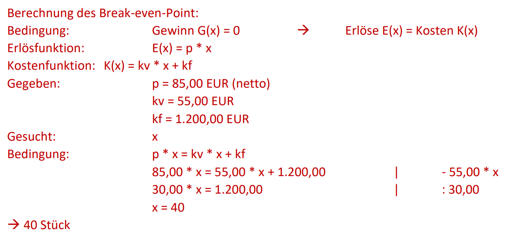
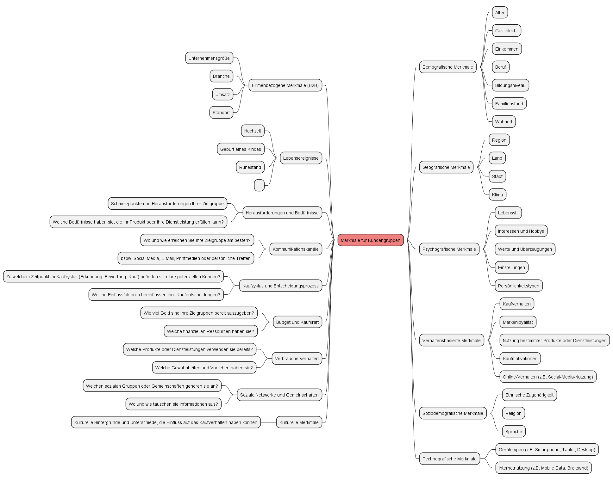

# Lösungshinweise zu Wirtschaftlichen Grundlagen (LF1 & LF2)

## Lösungshinweise zum Arbeitsauftrag - Willenserklärungen & Kaufverträge

### Aufgabe 1

Eine Willenserklärung ist eine Äußerung des Willens einer Person, durch die sie einen rechtlichen oder verbindlichen Zweck zum Ausdruck bringt. Sie kann schriftlich, mündlich oder konkludent (durch Handlungen) erfolgen und ist grundlegend für das Zustandekommen von Verträgen und anderen rechtlichen Vereinbarungen.

### Aufgabe 2

Der Kaufvertrag gehört zur Kategorie der mehrseitig verpflichtenden Rechtsgeschäfte. Das bedeutet, dass sowohl der Verkäufer als auch der Käufer verpflichtet sind, bestimmte Leistungen zu erbringen. Der Verkäufer verpflichtet sich, die verkaufte Sache zu übergeben, während der Käufer sich dazu verpflichtet, den Kaufpreis zu zahlen.

### Aufgabe 3

Aus einem Kaufvertrag ergeben sich folgende Pflichten:

Für den Verkäufer:

- Lieferpflicht: Der Verkäufer muss die verkaufte Sache in der vereinbarten Qualität und Menge sowie innerhalb der festgelegten Lieferfrist an den Käufer übergeben.
- Übereignungspflicht: Der Verkäufer muss das Eigentum an der verkauften Sache auf den Käufer übertragen, sobald die Sache übergeben wurde.

Für den Käufer:

- Zahlungspflicht: Der Käufer ist verpflichtet, den vereinbarten Kaufpreis an den Verkäufer zu zahlen.
- Annahmepflicht: Der Käufer muss die gekaufte Sache annehmen, wenn der Verkäufer seine Lieferpflicht erfüllt hat.

### Aufgabe 4

Der Kaufvertrag ist in diesem Fall zustande gekommen, als der Kunde die 5 Notebooks zu dem im Angebot genannten Preis bestellt hat und der Lieferant die Bestellbestätigung gesendet hat.

Die beiden Aspekte der Willenserklärungen in diesem Szenario sind:

1. Angebot und Annahme: Der Kunde hat eine Anfrage nach dem Preis für 10 Notebooks gestellt, was als eine Art Vorverhandlung angesehen werden kann. Der Lieferant hat dann ein Angebot über 10 Notebooks zu einem bestimmten Preis gesendet. Als der Kunde daraufhin 5 Notebooks zu diesem Preis bestellte, hat er das Angebot des Lieferanten angenommen. Damit war der Vertrag zustande gekommen.
2. Vertragsannahme durch Bestätigung: Die Bestellbestätigung des Lieferanten stellt eine Bestätigung der Annahme des Kunden dar. Dies bestätigt, dass der Lieferant die Bestellung des Kunden akzeptiert und den Vertrag abschließt. Die Bestellbestätigung fungiert als Antwort auf die Annahme des Angebots durch den Kunden und führt zur Verbindlichkeit des Kaufvertrags.

## Lösungshinweise zum Arbeitsauftrag - Beschaffungskalkulation durchführen

### Aufgabe 1

| | | Lieferant A | Lieferant B | Lieferant C | Lieferant D |
| :---: | --- | ---: | ---: | ---: | ---: |
|   | Listenverkaufspreis (für 10 Stück) | 5.990,00 | 6.500,00 | 5.700,00 | 6.250,00 |
| - | Rabatt in Prozent   | 5 % | 10 % | 0 % | 8 % |
| - | Rabatt in Euro      | 299,50 | 650,00 | 0,00 | 500,00 |
| = | Zieleinkaufspreis   | 5.690,50 | 5.850,00 | 5.700,00 | 5.750,00 |
| - | Skonto in Prozent   | 1 % | 2 % | 2 % | 3 % |
| - | Skonto in Euro      | 56,91 | 117,00 | 114,00 | 172,50 |
| = | Bareinkaufspreis    | 5.633,60 | 5.733,00 | 5.586,00 | 5.577,50 |
| + | Beschaffungskosten  | 50,00 | 35,00 | 80,00 | 50,00 |
| = | Einstandspreis      | 5.683,60 | 5.768,00 | 5.666,00 | 5.627,50 |

### Aufgabe 2

Die Einstandspreise sind die tatsächlichen Kosten, die ein Unternehmen für den Einkauf eines Produkts bei einem Lieferanten hat. Da die Preise und Rabatte der Lieferanten variieren können und verschiedene zusätzliche Kosten wie Versandkosten und Skonti angeboten werden, ist der Vergleich über die Einstandspreise wichtig, um herauszufinden, welcher Lieferant die Notebooks zu den günstigsten Gesamtkosten anbietet. Ein niedrigerer Einstandspreis bedeutet normalerweise, dass das Unternehmen das Produkt zu niedrigeren Kosten einkaufen kann, was sich auf die Rentabilität und Wettbewerbsfähigkeit auswirkt.

### Aufgabe 3

Ein weiteres Entscheidungskriterium, das in diesem Fall herangezogen werden könnte, ist die Qualität der Notebooks und der Ruf der Lieferanten. Wenn alle anderen Faktoren wie Einstandspreise, Rabatte, Skonti und Versandkosten ähnlich sind, kann die Reputation der Lieferanten und die Qualität der Produkte eine entscheidende Rolle bei der Wahl des Lieferanten spielen. Ein zuverlässiger Lieferant mit hochwertigen Produkten könnte eine bessere langfristige Investition sein, selbst wenn die Preisdifferenzen minimal sind.

## Lösungshinweise zum Arbeitsauftrag - Variable und fixe Kosten unterscheiden (BEP-Analyse)

### Aufgabe 1

- **Variable Kosten** sind Kosten, die sich in Abhängigkeit von der Produktions- oder Verkaufsmenge verändern. Sie steigen, wenn die Produktion oder der Verkauf erhöht werden, und sinken bei verringerten Mengen. Beispiele für variable Kosten sind Rohstoffkosten, Arbeitskosten, Versandkosten usw.
- **Fixkosten** sind Kosten, die unabhängig von der Produktions- oder Verkaufsmenge konstant bleiben. Sie ändern sich nicht, wenn die Aktivitäten des Unternehmens steigen oder fallen. Beispiele für Fixkosten sind Mietkosten, Gehälter der festen Mitarbeiter, Versicherungsprämien usw.
- **Gesamtkosten** setzen sich aus variablen Kosten und Fixkosten zusammen. Mathematisch ausgedrückt: Gesamtkosten = Variable Kosten + Fixkosten. Gesamtkosten repräsentieren die gesamten Kosten, die ein Unternehmen zur Produktion einer bestimmten Menge an Produkten oder Dienstleistungen aufbringen muss.

### Aufgabe 2

Beispiele für variable Kosten:

- Rohstoffkosten: Je mehr Produkte hergestellt werden, desto höher sind die Kosten für die benötigten Rohstoffe.
- Arbeitskosten: Bei erhöhter Produktion steigen auch die Lohn- und Gehaltskosten für die Arbeiter.
- Versandkosten: Wenn mehr Produkte verschickt werden, steigen die Versandkosten.

Beispiele für Fixkosten:

- Miete für Produktionsräume: Die Mietkosten bleiben konstant, unabhängig von der Produktionsmenge.
- Gehälter der Verwaltungsmitarbeiter: Die Gehälter der festen Mitarbeiter ändern sich nicht mit der Produktionsmenge.
- Versicherungsprämien: Die Kosten für Versicherungen bleiben gleich, egal wie viele Produkte hergestellt werden.

### Aufgabe 3

### Aufgabe 4

Bei der Berechnung des Break-even-Points mit Anteiligen Stückzahlen (z.B. 14,2 Stück) muss gerundet werden, da eine Stückzahl von 0,2 Stück in der realen Produktion nicht existiert.

Bei der Berechnung der Break-even-Menge wird in der Regel **aufgerundet**. Die rechnerische Lösung von anteiligen Stück trifft genau den Punkt, an dem Erlöse genau so hoch sind wie die Kosten bzw. der Gewinn gleich 0 ist.

Wenn an dieser Stelle zur nächsten ganzen Einheit abgerundet würde, würden wir vom Gewinn gleich 0 in einen Bereich wechseln, bei dem der Gewinn unter 0 und damit negativ wäre. Wir befänden uns in der Verlustzone.

Wenn von der rechnerischen Lösung mit anteiligen Stück allerdings aufgerundet würde, wären wir in der sogenannten Gewinnzone. Hier treffen wir nun die Definition des Break-even-Points, also dem Punkt ab dem der erste Gewinn erzielt wird.

## Lösungshinweise zum Arbeitsauftrag - Kostenvergleich durchführen

### Aufgabe 1

- **Miete** ist eine finanzielle Vereinbarung, bei der eine Person oder ein Unternehmen regelmäßig Zahlungen leistet, um einen Vermögenswert zu nutzen, ohne Eigentum daran zu erwerben. Der Besitz liegt beim Vermieter, während der Mieter den Nutzen aus dem Vermögenswert zieht.
- **Leasing** ist eine Form der Finanzierung, bei der ein Vermögenswert (z.B. Auto, Ausrüstung) für einen bestimmten Zeitraum gegen regelmäßige Zahlungen genutzt wird. Im Gegensatz zur Miete <u>kann</u> der Leasingnehmer am Ende der Leasinglaufzeit die Option haben, den Vermögenswert zu kaufen. Während der Leasingdauer liegt das Eigentum beim Leasinggeber, der Besitz beim Leasingnehmer.
- Beim **Kauf mittels Darlehen** erwirbt der Käufer einen Vermögenswert, z.B. eine Immobilie oder technische Anlage, indem er ein Darlehen von einer Bank aufnimmt. Der Käufer zahlt das Darlehen über einen festgelegten Zeitraum in Raten zurück. Das Eigentum geht sofort auf den Käufer über, aber die Bank hat eine Sicherheit aufgrund des Darlehens, bis es vollständig zurückgezahlt ist.

### Aufgabe 2

| Jahr | Anfangsschuld | Zinsen | Tilgung | Gesamt | Restschuld |
| :---: | ---: | ---: | ---: | ---: | ---: |
| 1 | 7.500,00 EUR | 450,00 EUR | 2.500,00 EUR | 2.950,00 EUR | 5.000,00 EUR |
| 2 | 5.000,00 EUR | 300,00 EUR | 2.500,00 EUR | 2.800,00 EUR | 2.500,00 EUR |
| 3 | 2.500,00 EUR | 150,00 EUR | 2.500,00 EUR | 2.650,00 EUR | 0,00 EUR |
| Gesamt | - | 900,00 EUR | 7.500,00 EUR | 8.400,00 EUR | - |

### Aufgabe 3

Leasingkosten = 240 EUR/Monat * 36 Monate = 8.640,00 EUR

### Aufgabe 4

Die Darlehensfinanzierung ist 240,00 EUR günstiger als die Leasinglösung.

8.640,00 EUR - 8.400,00 EUR = 240,00 EUR

### Aufgabe 5

- **Steuerliche Vorteile:** Leasingzahlungen können oft als Betriebskosten abgesetzt werden.
- **Geringere anfängliche Ausgaben:** Es muss zu Beginn der Zeit der Anschaffung kein großer Betrag aufgebracht werden (zulasten der Kreditwürdigkeit oder zulasten des Bar-/Kassenvermögens). Die Beträge sind gegenüber der auf einen Schlag zu bezahlenden Anschaffungskosten von Beginn an niedriger.
- **Flexibilität:** Nach Ablauf des Leasingvertrags kann ein Unternehmen leicht auf neuere Modelle umsteigen.

### Aufgabe 6

- **Eigentumsübertragung:** Der Käufer hat sofortiges Eigentum und Kontrolle über den Vermögenswert.
- **Langfristige Einsparungen:** Obwohl das Darlehen höhere Zinsen verursachen kann, werden Sie am Ende des Darlehens Eigentümer des Vermögenswertes, was auf lange Sicht Einsparungen bedeuten kann.
- **Keine Laufzeitbegrenzung:** Beim Kauf gibt es keine Begrenzung der Nutzungszeit wie beim Leasing.
- **Anpassungsfreiheit:** Der Käufer kann den Vermögenswert nach Belieben anpassen oder ändern.

## Lösungshinweise zum Arbeitsauftrag - Qualitativen Angebotsvergleich durchführen

### Aufgabe 1

Der qualitative Angebotsvergleich konzentriert sich auf subjektive und nicht messbare Faktoren wie Qualität, Reputation, Erfahrung und Kundenservice. Ziel des qualitativen Angebotsvergleichs ist es, die Anbieter anhand dieser nicht quantifizierbaren Kriterien zu bewerten und den besten Anbieter aufgrund von subjektiven Faktoren auszuwählen.

Der quantitative Angebotsvergleich hingegen verwendet messbare Kriterien wie die Preise im Sinne der Bezugskalkulation. Ziel des quantitativen Angebotsvergleichs ist es, die Anbieter anhand objektiver Daten zu bewerten und die beste Wahl basierend auf diesen messbaren Kriterien zu treffen.

### Aufgabe 2

- **Preis:** Die Kosten für die Hardware und eventuelle Wartung oder Erweiterung.
- **Leistung:** Die technischen Spezifikationen, um sicherzustellen, dass die Geräte den Anforderungen des Kunden entsprechen.
- **Ergonomie:** Die Benutzerfreundlichkeit und Ergonomie der Geräte, um eine komfortable Nutzung zu gewährleisten.
- **Verfügbarkeit:** Die Lieferfähigkeit der Lieferanten und die Möglichkeit, die benötigten Geräte rechtzeitig zu erhalten.
- **Kosten für Wartung/Erweiterung:** Die geschätzten Kosten für Wartung, Reparaturen und mögliche zukünftige Erweiterungen.
- **Service:** Der Kundenservice und die Supportqualität der Lieferanten.
- **Marken-/Hersteller-Reputation:** Die Bekanntheit und der Ruf der Hersteller der angebotenen Geräte.
- **Produktvielfalt:** Die Auswahl an Geräten und Konfigurationen, die von den Lieferanten angeboten werden.
- **Garantiebedingungen:** Die Garantieleistungen und -bedingungen für die Geräte.
- **Nachhaltigkeit:** Die Umweltauswirkungen der hergestellten Geräte und die Nachhaltigkeitsbemühungen der Lieferanten.

### Aufgabe 3

|       |      | 1     | 2     | 3     | 4     |       |       |       |
| :---: | :--- | :---: | :---: | :---: | :---: | :---: | :---: | :---: |
| | | **Preis** | **Leistung** | **Region** | **Service** | **Punkte** | **Rang** | **Gewichtung in %** |
| **1** | **Preis**     | - | 2 | 2 | 2 | **6** | **1** | **50** |
| **2** | **Leistung**  |   | - |   |   | **3** | **2** | **25** |
| **3** | **Region**    | 0 | 1 | - | 1 | **2** | **3** | **17** |
| **4** | **Service**   | 0 | 0 | 1 | - | **1** | **4** | **8** |
|       | **Summe**     |   |   |   |   | **12** | - | **100** |

#### Aufgabe 4

| Nr.   | Kriterium | Gewichtung | Notebook | | All-in-One-PC | | Thin-Client | | Desktop | |
| :---: | :---      | ---:       | :--- | :--- | :--- | :--- | :--- | :--- | :--- | :--- |
|       | | |Punkte | Gewichtete Punkte | Punkte | Gewichtete Punkte | Punkte | Gewichtete Punkte | Punkte | Gewichtete Punkte |
| 1 | Platzbedarf | 15 % | 2 | 0,3 | 3 | 0,45 | **4** | **0,6** | **1** | **0,15** |
| 2 | Ergonomie   | 20 % | 2 | 0,4 | **1** | **0,2** | 4 | 0,8 | **3** | **0,6** |
| 3 | Performance	| 10 % | 3 | 0,3 | **1** | **0,1** | 2 | 0,2 | **4** | **0,4** |
| 4 | Verfügbarkeit | 20 % | 4 | 0,8 | 2 | 0,4 | 1 | 0,2 | 3 | 0,6 |
| 5 | Kosten für Wartung / Erweiterung | 15 % | 2 | 0,3 | **1** | **0,15** | 4 | 0,6 | **3** | **0,45** |
| 6 | Preis	| 20 % | **1** | **0,2** | **3** | **0,6** | **4** | **0,8** | **2** | **0,4** |
|   | Auswertung | 100 % | - | **2,3** | - | **1,9** | - | **3,2** | - | **2,6** |

## Lösungshinweise zum Arbeitsauftrag - Lizenzarten unterscheiden

### Aufgabe 1

- **Einzelbenutzer-Lizenz**: Bei einer Einzelbenutzer-Lizenz handelt es sich um eine Softwarelizenz, die es einer einzelnen Person gestattet, die Software auf einem einzigen Computer oder Gerät zu installieren und zu verwenden. Sie ist auf die Nutzung durch eine einzige Person beschränkt.
- **Mehrbenutzer-Lizenz**: Eine Mehrbenutzer-Lizenz erlaubt es einer festgelegten Anzahl von Nutzern oder Geräten, die Software zu nutzen. Die Anzahl der erlaubten Benutzer oder Geräte wird in der Lizenz festgelegt, und nur diese dürfen die Software verwenden.
- **Unternehmenslizenz**: Eine Unternehmenslizenz erlaubt es einer Organisation, die Software in ihrem gesamten Unternehmen zu nutzen. Alle Mitarbeiter in dieser Organisation dürfen die Software verwenden, solange sie im Rahmen der Lizenzbestimmungen handeln.
- **Site-Lizenz**: Eine Site-Lizenz erlaubt es einer Organisation, die Software an einem bestimmten physischen Standort oder einer bestimmten Einrichtung zu nutzen. Es spielt keine Rolle, wie viele Benutzer es gibt; die Lizenz bezieht sich auf die Verwendung an diesem speziellen Ort.
- **Academic/Institutional Licence**: Diese Art von Lizenz ist oft für Bildungseinrichtungen oder akademische Institutionen gedacht. Sie erlaubt den Angehörigen der Institution, die Software für Forschung, Lehre und andere Zwecke zu nutzen.
- **Named User Licence**: Bei einer Named User Licence sind bestimmte Benutzer namentlich aufgeführt und dürfen die Software nutzen. Diese Benutzer sind identifiziert und dürfen die Software exklusiv verwenden.
- **Concurrent User Licence**: Diese Lizenz erlaubt eine festgelegte Anzahl von Nutzern, die Software gleichzeitig zu verwenden. Die Lizenz beschränkt die gleichzeitige Nutzung, nicht die Gesamtanzahl der Benutzer.

### Aufgabe 2

- **Open Source Lizenz**: Eine Open-Source-Lizenz erlaubt es den Benutzern, den Quellcode der Software einzusehen, zu modifizieren und zu verteilen. Sie fördert die Offenheit und Zusammenarbeit in der Softwareentwicklung. Beispiele sind die GNU General Public License (GPL) und die MIT-Lizenz.
- **Freie Software Lizenz**: Freie Softwarelizenzen gewähren den Benutzern Freiheiten wie das Recht, die Software zu verwenden, zu kopieren, zu modifizieren und zu verteilen. Die GPL ist ein bekanntes Beispiel für eine solche Lizenz.
- **Copyleft-Lizenz**: Copyleft-Lizenzen sind eine Untergruppe von freien Softwarelizenzen, die sicherstellen, dass abgeleitete Werke ebenfalls unter der gleichen Lizenz veröffentlicht werden. Die GPL ist ein prominentes Beispiel für eine Copyleft-Lizenz.
- **Shared Source Lizenz**: Bei Shared Source Lizenzen dürfen Benutzer den Quellcode sehen, aber es können Einschränkungen in Bezug auf dessen Verwendung und Verbreitung auferlegt sein. Microsoft verwendet beispielsweise Shared Source Lizenzen für einige seiner Produkte.

### Aufgabe 3

- **Proprietäre Softwarelizenz**: Eine proprietäre Softwarelizenz gibt dem Softwarehersteller die Kontrolle über den Quellcode und erlaubt den Benutzern oft nur die Verwendung der Software gegen Bezahlung einer Lizenzgebühr. Die Benutzer haben begrenzte Freiheiten in Bezug auf die Anpassung und Weitergabe der Software.
- **Freie Softwarelizenz**: Freie Softwarelizenzen gewähren den Benutzern die Freiheit, die Software frei zu verwenden, zu kopieren, zu modifizieren und zu verteilen. Es geht darum, die Freiheit und Zusammenarbeit zu fördern.
- **Open-Source-Lizenz**: Open-Source-Lizenzen erlauben den Benutzern, den Quellcode der Software einzusehen, zu modifizieren und zu verteilen, während sie oft weniger restriktiv sind als freie Softwarelizenzen.
- **Shareware-Lizenz**: Shareware-Software ist oft als Testversion kostenlos verfügbar, erfordert jedoch die Zahlung einer Lizenzgebühr, um die volle Version freizuschalten.
- **Freemium-Lizenz**: Freemium-Software bietet eine Basisversion kostenlos an, erlaubt jedoch den Kauf von Premium-Funktionen oder Dienstleistungen.
- **Open-Core-Lizenz**: Bei diesem Modell wird der Kern einer Software unter einer Open-Source-Lizenz veröffentlicht, während zusätzliche Funktionen oder Dienste proprietär sind und kostenpflichtige Lizenzen erfordern.
- **Software as a Service (SaaS)**: Bei SaaS-Modellen wird die Software in der Cloud gehostet, und Benutzer zahlen in der Regel Abonnementgebühren, um darauf zuzugreifen, anstatt eine Softwarelizenz zu erwerben.

### Aufgabe 4

- **Kostenlose Open-Source-Software**: Diese Art von Open-Source-Software ist tatsächlich kostenlos im Sinne von "kostenlos". Benutzer können die Software herunterladen und verwenden, ohne dafür zu bezahlen. Beispiele sind viele Linux-Distributionen und Webbrowser wie Firefox.
- **Open-Source-Software mit kostenpflichtigem Support**: Hier ist die Software selbst Open Source und kostenlos, aber Unternehmen bieten kostenpflichtigen Support, Schulungen oder Dienstleistungen rund um die Software an.
- **Open-Source-Software mit Dual-Lizenzierung**: Diese Software wird unter einer Open-Source-Lizenz veröffentlicht, erlaubt aber auch den Erwerb einer proprietären Lizenz mit erweiterten Funktionen oder Rechten.
- **Open-Source-Software mit Freemium-Modell**: Die Grundversion der Software ist kostenlos, aber erweiterte Funktionen oder Dienstleistungen erfordern den Kauf einer kostenpflichtigen Version.
- **Open-Source-Software mit Abonnementmodell**: Benutzer zahlen regelmäßige Abonnementgebühren, um Zugang zu aktualisierten Versionen oder speziellem Support zu erhalten. Dies ist häufig bei SaaS-Modellen anzutreffen.

## Lösungshinweise zum Arbeitsauftrag - Marktformen unterscheiden

### Aufgabe 1

- **Polypol**: Hier gibt es viele Anbieter und viele Nachfrager. Kein einzelner Marktteilnehmer hat erheblichen Einfluss auf den Marktpreis. Ein Beispiel dafür ist der Markt für landwirtschaftliche Produkte wie Weizen, wo viele Bauern Weizen verkaufen und viele Käufer ihn kaufen.
- **Monopol**: In einem Monopolmarkt gibt es nur einen einzigen Anbieter, der den gesamten Markt kontrolliert. Es gibt viele Nachfrager, aber der Anbieter kann den Preis bestimmen. Ein Beispiel wäre ein staatliches Monopol für die Wasserversorgung in einer Stadt.
- **Oligopol**: In einem Oligopolmarkt gibt es nur wenige große Anbieter, die den Markt dominieren. Es gibt viele Nachfrager, aber die wenigen Anbieter können den Preis beeinflussen. Ein Beispiel dafür ist der Markt für Smartphones, wo nur wenige große Unternehmen den Großteil des Marktes beherrschen.

### Aufgabe 2

- **Sehr homogene Produkte**: In einem Markt mit sehr homogenen Produkten gibt es oft intensiven Wettbewerb. Da die Produkte praktisch identisch sind, haben die Käufer keinen Grund, einen höheren Preis zu akzeptieren. Ein Beispiel wäre der Markt für Rohöl. Rohöl ist ein sehr homogenes Produkt, und die Preise werden stark von Angebot und Nachfrage beeinflusst.
- **Sehr heterogene Produkte**: Wenn es sich um sehr heterogene Produkte handelt, kann der Wettbewerb unterschiedlich sein. Wenn die Produkte stark differenziert sind, haben die Anbieter oft mehr Preissetzungsmacht. Ein Beispiel wäre der Markt für Luxusautos, wo verschiedene Marken und Modelle mit erheblichen Preisunterschieden existieren.

### Aufgabe 3

- **Hohe Eintrittsbarrieren**: Hohe Eintrittsbarrieren erschweren neuen Unternehmen den Markteintritt. Dies kann zu weniger Wettbewerb führen, da etablierte Unternehmen ihre Position behalten. Beispiele für hohe Eintrittsbarrieren sind hohe Anfangsinvestitionen, starke Markenbindung und staatliche Regulierungen. Ein Markt mit hohen Eintrittsbarrieren könnte der Markt für Raumfahrttechnologie sein, aufgrund der enormen Kosten und des technischen Know-hows, das für den Markteintritt erforderlich ist.
- **Niedrige Eintrittsbarrieren**: Niedrige Eintrittsbarrieren erleichtern es neuen Unternehmen, in den Markt einzutreten. Dies kann zu mehr Wettbewerb führen, da es einfacher ist, neue Wettbewerber auf den Markt zu bringen. Ein Beispiel für einen Markt mit niedrigen Eintrittsbarrieren könnte der Markt für mobile Apps sein, da Entwickler relativ einfach neue Apps erstellen und auf den Markt bringen können.

### Aufgabe 4

- **Monopolregulierung**: Wenn staatliche Regulierung Monopole kontrolliert, kann dies dazu beitragen, Missbrauch von Marktmacht zu verhindern. Ein Beispiel ist die Regulierung von Strom- oder Wasserversorgungsunternehmen, um sicherzustellen, dass sie faire Preise und angemessene Dienstleistungen bieten.
- **Wettbewerbsregulierung**: Regulierungsbehörden können den Wettbewerb fördern, indem sie die Marktmacht großer Unternehmen begrenzen. Dies kann dazu beitragen, Oligopole in ihrer Fähigkeit zur Preisfestlegung zu beschränken und den Wettbewerb zu stärken.
- **Qualitäts- und Sicherheitsstandards**: Die Regierung kann Qualitäts- und Sicherheitsstandards für Produkte und Dienstleistungen festlegen, um die Verbraucher zu schützen und das Vertrauen in den Markt zu stärken.
- **Preisregulierung**: In einigen Fällen kann die Regierung Preise für wichtige Güter und Dienstleistungen festlegen, um sicherzustellen, dass sie für alle zugänglich sind. Ein Beispiel ist die Preisregulierung im Gesundheitswesen.

## Lösungshinweise zum Arbeitsauftrag - Zielgruppen definieren

### Aufgabe 1

### Aufgabe 2

Im Zusammenhang mit Zielgruppen ist eine "Persona" eine fiktive, aber detaillierte Darstellung einer typischen Vertreterin oder eines typischen Vertreters Ihrer Zielgruppe. Personas sind eine nützliche Methode, um Ihre Zielgruppe besser zu verstehen und Ihre Marketing- und Kommunikationsstrategien zu personalisieren.

Hierfür werden Informationen benötigt. Bspw.

- **Demografische Informationen:** Dies umfasst Alter, Geschlecht, Beruf, Einkommen, Familienstand und geografische Lage.
- **Psychografische Informationen:** Hierzu gehören Interessen, Hobbys, Werte, Einstellungen, Lebensstil und Verhaltensweisen.
- **Ziele und Bedürfnisse:** Was möchte diese Persona erreichen? Welche Bedürfnisse und Probleme hat sie?
- **Herausforderungen und Schmerzpunkte:** Welche Hindernisse könnten dieser Persona im Weg stehen? Was frustriert oder besorgt sie?
- **Kommunikationspräferenzen:** Auf welchen Kanälen und Plattformen ist diese Persona am aktivsten? Nutzt sie eher soziale Medien, E-Mails oder andere Kommunikationsmittel?
- **Kaufverhalten:** Wie trifft diese Persona Kaufentscheidungen? Welche Faktoren beeinflussen ihre Kaufentscheidungen?
- **Marke und Produktpräferenzen:** Welche Marken oder Produkte bevorzugt diese Persona? Warum?
- **Name und Foto:** Um die Persona lebendiger zu gestalten, geben Marketer oft der Persona einen Namen und verwenden ein Foto, um sich besser vorstellen zu können, mit wem sie es zu tun haben.

Die Erstellung von Personas basiert normalerweise auf Marktforschung und Datenanalyse sowie auf Kundeninterviews und -umfragen. Wenn Sie Personas erstellen, können Sie Ihre Marketingbotschaften, Inhalte und Angebote besser an die Bedürfnisse und Vorlieben Ihrer Zielgruppen anpassen. Jede Persona hilft Ihnen dabei, Ihre Kunden besser zu verstehen und wie sie denken, fühlen und handeln.

Wenn Sie mehrere Personas erstellen, können Sie auch unterschiedliche Marketingstrategien für verschiedene Segmente Ihrer Zielgruppe entwickeln, um gezieltere und effektivere Kampagnen durchzuführen.

### Aufgabe 3

1. **Marktforschung durchführen:** Beginnen Sie mit einer umfassenden Marktforschung, um Informationen über den Markt und potenzielle Kunden zu sammeln. Analysieren Sie vorhandene Daten, führen Sie Umfragen durch, beobachten Sie Trends und nutzen Sie Wettbewerbsanalysen.
2. **Demografische Merkmale identifizieren:** Bestimmen Sie demografische Faktoren wie Alter, Geschlecht, Einkommen, Beruf, Familienstand und Wohnort Ihrer potenziellen Kunden. Diese Informationen helfen Ihnen, Ihre Zielgruppe besser zu verstehen.
3. **Psychografische Merkmale berücksichtigen:** Untersuchen Sie die Lebensweise, Interessen, Werte, Einstellungen und Verhaltensweisen Ihrer Zielgruppe. Dies kann Ihnen helfen, deren Motivationen und Bedürfnisse zu verstehen.
4. **Kundenbedürfnisse und -probleme identifizieren:** Analysieren Sie, welche Bedürfnisse und Probleme Ihre Produkte oder Dienstleistungen lösen können. Identifizieren Sie, wie Ihre Zielgruppe von Ihrem Angebot profitieren kann.
5. **Wettbewerbsanalyse durchführen:** Schauen Sie sich an, wie Ihre Mitbewerber ihre Zielgruppen ansprechen. Dies kann Ihnen Hinweise darauf geben, wie Sie sich differenzieren können.
6. **Persona-Entwicklung:** Erstellen Sie detaillierte Kundenpersonas, die Ihre Zielgruppe repräsentieren. Geben Sie diesen fiktiven Personen Namen, Hobbys, Interessen und Probleme. Dies hilft Ihnen, sich besser in Ihre Zielgruppe hineinzuversetzen.
7. **Segmentierung vornehmen:** Teilen Sie Ihre Zielgruppe in verschiedene Segmente auf, je nachdem, welche Merkmale oder Bedürfnisse sie gemeinsam haben. Dies ermöglicht es Ihnen, maßgeschneiderte Marketingbotschaften zu erstellen.
8. **Zielgruppenpriorisierung:** Bestimmen Sie, welche Zielgruppen für Ihr Unternehmen am wichtigsten sind. Möglicherweise möchten Sie sich auf eine Hauptzielgruppe konzentrieren, bevor Sie andere ansprechen.
9. **Testen und Anpassen:** Setzen Sie Ihre Marketingstrategie um und beobachten Sie die Ergebnisse. Wenn nötig, passen Sie Ihre Zielgruppendefinition und Ihre Strategie an.
10. **Kontinuierliche Aktualisierung:** Die Bedürfnisse und Präferenzen Ihrer Zielgruppen können sich im Laufe der Zeit ändern. Bleiben Sie auf dem Laufenden und passen Sie Ihre Marketingstrategie entsprechend an.

### Aufgabe 4

- **Online-Werbung:** Plattformen wie Google Ads und Facebook Ads ermöglichen es Werbetreibenden, gezielt auf bestimmte demografische Merkmale, Interessen und Verhaltensweisen zugeschnittene Anzeigen zu schalten.
- **Soziale Medien:** Auf Plattformen wie Facebook, Instagram, X und LinkedIn können Sie Zielgruppen basierend auf demografischen und psychografischen Merkmalen ansprechen.
- **Content-Marketing:** Durch die Analyse des Nutzerverhaltens können Sie personalisierte Inhalte erstellen und anbieten, die auf die Interessen und Bedürfnisse Ihrer Zielgruppe zugeschnitten sind.
- **E-Mail-Marketing:** Sie können Ihre E-Mail-Liste in Segmente aufteilen und gezielte E-Mails an bestimmte Gruppen von Abonnenten senden, basierend auf deren Verhalten und Interessen.
- **Suchmaschinenmarketing (SEM):** Durch die Auswahl relevanter Keywords und das Bieten auf diese in Suchmaschinenanzeigen können Sie Nutzer ansprechen, die nach bestimmten Produkten oder Dienstleistungen suchen.
- **Programmatic Advertising:** Mit Programmatic Advertising können Sie Anzeigen automatisch an die richtige Zielgruppe ausliefern, basierend auf Echtzeitdaten und Algorithmen.
- **Retargeting und Remarketing:** Nutzen Sie Cookies, um Besucher Ihrer Website erneut anzusprechen, indem Sie ihnen personalisierte Anzeigen auf anderen Websites anzeigen.
- **Influencer-Marketing:** Partner mit Influencern werden, die Ihre Zielgruppe ansprechen, um Ihre Produkte oder Dienstleistungen zu bewerben.
- **Kundendatenanalyse:** Analysieren Sie Kundendaten, um Einblicke in das Verhalten und die Vorlieben Ihrer Zielgruppe zu gewinnen und Ihre Marketingbotschaften entsprechend anzupassen.
- **Künstliche Intelligenz (KI) und maschinelles Lernen:** KI kann dazu verwendet werden, personalisierte Empfehlungen und Inhalte für Nutzer zu erstellen, basierend auf deren früherem Verhalten.
- **Chatbots und KI-gesteuerte Kommunikation:** Verwenden Sie Chatbots und KI, um auf Anfragen und Fragen von Kunden in Echtzeit zu reagieren und personalisierte Empfehlungen zu geben.
- **Geolokationsbasiertes Marketing:** Nutzen Sie die Standortdaten von Nutzern, um lokale Zielgruppen gezielt anzusprechen und relevante Angebote bereitzustellen.

