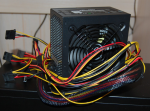
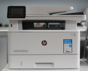
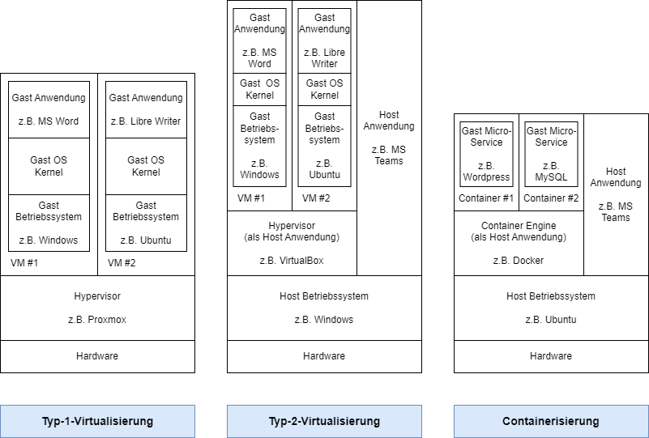
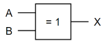
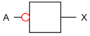

# IT-Grundlagen

## RAID-Level unterscheiden

### Arbeitsauftrag - RAID-Level unterscheiden

#### Aufgabe 1

| Kriterium | RAID 0 | RAID 1 | RAID 5 | RAID 6 | RAID 10 |
| :--- | :--- | :--- | :--- | :--- | :--- |
| Mindestanzahl der Festplatten | 2 | 2 | 3 | 4 | 4 |
| Funktionsweise | Striping | Mirroring | Striping mit Parity | Striping mit Double-Parity | Striping mit anschließendem Mirroring |
| Nettospeicherkapazität allgemein | Kapazität der kleinsten Festplatte * Anzahl der Festplatten | Kapazität der kleinsten Festplatte | Kapazität der kleinsten Festplatte * (Anzahl der Festplatten - eine Festplatte) | Kapazität der kleinsten Festplatte * (Anzahl der Festplatten - zwei Festplatten) | Kapazität der kleinsten Festplatte * Anzahl der Festplatten / 2 |
| Nettospeicherkapazität am Beispiel | 8 TB * 4 = 32 TB | 8 TB | 8 TB * (4 - 1) = 24 TB | 8 TB * (4 - 2) = 16 TB | 8 TB * 4 / 2 = 16 TB |
| Festplattenausfall ohne Datenverlust allgemein | keine | alle bis auf eine | max. eine | max. zwei | max. die Hälfte, wenn immer nur eine aus dem jeweiligen RAID 1 Verbund betroffen ist |
| Festplattenausfall ohne Datenverlust am Beispiel | keine | max. 3 | max. 1 | max. 2 | Best-Case: max. 2 (aus unterschiedlichem RAID 1 Verbund) / Worst-Case: max. 1 (wenn sonst die zweite Festplatte eines RAID 1 Verbunds betroffen sind) |
| Erweiterung des RAID-Verbunds | immer um eine Festplatte möglich | immer um eine Festplatte möglich | immer um eine Festplatte möglich | immer um eine Festplatte möglich | immer um zwei Festplatten als weiteren RAID 1 Verbund möglich |

#### Aufgabe 2

Das NAS hat 8 Laufwerke. Ein Laufwerk davon dient als Hot Spare (nicht im Verbund befindlich und bereit für ein ausgefallenes Laufwerk an die Stelle zu treten) und damit 7 aktiven Laufwerken eine ungerade Anzahl.

In näheren Betracht kommen die RAID-Level 6 und 10, da bei beiden Konzepten zwei Laufwerke ohne Datenverlust ausfallen dürfen (bei RAID 10 und Best-Case sogar mehr).

Da das RAID-Level 10 allerdings eine gerade Anzahl Laufwerke benötigt, würde die Kapazität der 7. aktiven Festplatte nicht eingebracht werden können. Damit bleibt lediglich RAID 6 als Option übrig.

Die Mindestnettokapazität von drei Festplatten ist beim RAID 6 bei 7 aktiven Laufwerken gegeben, es werden zwei Laufwerke für Paritäten verwendet, es bleiben damit fünf Laufwerke für die Nettokapazität:

- 5 Laufwerke Nettokapazität
- 2 Laufwerke für Paritäten
- 1 Laufwerk als Hot Spare

#### Aufgabe 3

RAID und Backups sind beide wichtige Strategien zur Sicherung von Daten, insbesondere hinsichtlich des Schutzziels der Verfügbarkeit. Sie ergänzen sich jedoch, anstatt sich zu ersetzen, aus verschiedenen Gründen:

- **Fehlerhafte Datenspeicherung:** RAID-Systeme bieten Redundanz auf Hardwareebene und sind in der Lage, den Ausfall eines oder mehrerer Festplatten zu tolerieren, ohne dass Datenverlust auftritt. Dies trägt zur kontinuierlichen Verfügbarkeit bei, da der Betrieb weitergehen kann, selbst wenn Hardwarefehler auftreten. Allerdings schützt RAID nicht vor Datenverlust aufgrund von Fehlern auf Dateiebene, menschlichen Fehlern oder schädlicher Software.
- **Datenkorruption und Löschungen:** RAID schützt zwar vor physischen Festplattenausfällen, kann jedoch nicht vor Datenkorruption oder versehentlichen Löschungen schützen. In diesen Fällen sind Backups von entscheidender Bedeutung. Backups speichern Daten zu einem bestimmten Zeitpunkt und ermöglichen die Wiederherstellung von Daten, die in der Vergangenheit verloren gegangen sind.
- **Katastrophenschutz:** Backups sind unerlässlich, wenn es darum geht, Daten vor größeren Katastrophen zu schützen, wie zum Beispiel Naturkatastrophen, Brand oder Diebstahl. RAID-Systeme können den Ausfall von Festplatten in derselben physischen Umgebung bewältigen, bieten jedoch keinen Schutz, wenn die gesamte Umgebung zerstört wird. Backups, die an einem externen Ort aufbewahrt werden, stellen sicher, dass Daten selbst nach solchen katastrophalen Ereignissen wiederhergestellt werden können.
- **Historische Daten und Versionierung:** Backups ermöglichen es, auf historische Daten zuzugreifen und verschiedene Versionen von Dateien wiederherzustellen. RAID bietet in der Regel keine umfassende Versionierung. Dies ist wichtig, wenn es darum geht, frühere Datenzustände wiederherzustellen oder geänderte Dateien zu vergleichen.

#### Aufgabe 4

S.M.A.R.T. steht für "Self-Monitoring, Analysis, and Reporting Technology", was auf Deutsch etwa "Selbstüberwachung, Analyse und Berichterstattungstechnologie" bedeutet. Es handelt sich um einen branchenweiten Standard, der in Festplatten und SSD eingebaut ist. Die Hauptfunktion von S.M.A.R.T. besteht darin, die Gesundheit und Leistungsfähigkeit der Speichermedien zu überwachen und frühzeitig auf potenzielle Probleme oder drohende Ausfälle hinzuweisen.

S.M.A.R.T. sammelt eine Vielzahl von Daten und Parametern von der Festplatte, wie beispielsweise die Anzahl der fehlerhaften Sektoren, die Betriebstemperatur, die Anzahl der Betriebsstunden und vieles mehr. Diese Informationen werden von der Festplatte selbst überwacht, um Veränderungen oder Abweichungen von den erwarteten Werten zu erkennen. Wenn kritische Schwellenwerte überschritten werden oder Anomalien auftreten, kann S.M.A.R.T. Warnmeldungen generieren, um den Benutzer oder das System darauf hinzuweisen, dass eine Wartung oder ein Austausch der Festplatte erforderlich sein könnte.

Durch die regelmäßige Überwachung von S.M.A.R.T.-Daten können Benutzer und Systemadministratoren frühzeitig auf Probleme reagieren, bevor es zu einem vollständigen Ausfall der Festplatte kommt. Dies ermöglicht eine bessere Planung für die Datensicherung und den Austausch von Festplatten, um Datenverlust und Unterbrechungen zu minimieren. S.M.A.R.T. ist daher ein wichtiges Instrument zur Verbesserung der Verfügbarkeit und Zuverlässigkeit von Datenspeichergeräten.

#### Aufgabe 5

MTBF, oder "Meantime Between Failure" (deutsch: "Mittlere Betriebsdauer zwischen Ausfällen"), ist eine Kennzahl, die in der Informatik und insbesondere bei Speichermedien wie Festplatten und SSDs verwendet wird, um die erwartete durchschnittliche Zeitdauer zwischen Ausfällen oder Störungen zu quantifizieren. Die MTBF ist ein wichtiger Wert zur Bewertung der Zuverlässigkeit und Haltbarkeit von Hardwarekomponenten.

Die MTBF wird in Stunden oder Betriebszyklen gemessen und gibt an, wie lange ein Gerät im Durchschnitt zwischen zwei aufeinanderfolgenden Ausfällen oder Störungen funktionieren sollte. Je höher die MTBF ist, desto zuverlässiger wird das Speichermedium angesehen. Es ist jedoch wichtig zu beachten, dass die MTBF keine Garantie für die genaue Betriebsdauer eines einzelnen Geräts ist, sondern vielmehr eine statistische Schätzung basierend auf umfangreichen Tests und Erfahrungen mit ähnlichen Geräten.

Die MTBF ist ein nützlicher Indikator, um die Ausfallsicherheit von Speichermedien und anderen Hardwarekomponenten bei der Planung von IT-Infrastrukturen zu berücksichtigen. Organisationen können die MTBF-Werte verwenden, um Redundanz- und Backup-Strategien zu entwickeln, um sicherzustellen, dass Datenverlust und Betriebsunterbrechungen aufgrund von Hardwareausfällen minimiert werden.

## Übertragung von Daten berechnen

### Arbeitsauftrag - Übertragung von Daten berechnen

#### Aufgabe 1

#### Aufgabe 2

#### Aufgabe 3

## Energieeffizienz von IT-Systemen vergleichen

### Arbeitsauftrag - Energieeffizienz von IT-Systemen vergleichen

#### Aufgabe 1

**Elektrische Leistung**

Elektrische Leistung (P) = Elektrische Spannung (U) * Elektrischer Strom (I)

`P = U * I`

Beachten Sie dabei:
- Die Maßeinheit von P ist Watt (W).
- Die Maßeinheit von I ist Ampere (A).
- Die Maßeinheit von U ist Volt (V).

**Elektrische Energie**

Elektrische Energie (E) = Elektrische Leistung (P) * Zeit (t)

`E = P * t`

Beachten Sie dabei:
- Die Maßeinheit von E ist Wattstunden (Wh).
- Die Maßeinheit der Zeit ist für diesen Aufgabentyp in Stunden zu berechnen.

**Kosten**

Kosten = Elektrische Energie (E) * Preis (€)

`Kosten = E * Preis`

Beachten Sie dabei:
- Der Preis wird in der Regel in €/kWh angegeben.
- Die elektrische Energie muss in der Regel von Wattstunden (Wh) in Kilowattstunden (kWh) umgerechnet werden.

#### Aufgabe 2

#### Aufgabe 3

#### Aufgabe 4

**Frage 1:**

Power Usage Effectiveness (PUE) ist eine Metrik, die zur Schätzung der Energieeffizienz eines Rechenzentrums verwendet werden kann. Es wird berechnet, indem die Gesamtmenge an Energie, die in ein Rechenzentrum eingeht, durch die Energie geteilt wird, die nur für den Betrieb der IT-Ausrüstung im Rechenzentrum erforderlich ist. Je näher dieser Wert 1,0 kommt, desto effizienter ist das Rechenzentrum.

*"Power Usage Effectiveness (PUE) is a metric that can be used to estimate the energy efficiency of a data center. It is calculated by dividing the total amount of energy entering a data center by the energy required only to operate the IT equipment in the data center."*

**Frage 2:**

Die Überwachung einer Metrik wie PUE ist nützlich, um die Effizienz eines Rechenzentrums zu benchmarken. Unternehmen und Rechenzentrumsmanager verwenden die Metrik, um die aktuelle Effizienz ihrer Infrastruktur und den Erfolg von Modernisierungsbemühungen festzustellen. Dies hilft dabei, den Energieverbrauch und die Energiekosten zu senken.

*"Monitoring a metric like PUE is useful for benchmarking data center efficiency. Companies and data center managers use the metric to determine the current efficiency of their infrastructure and the success of modernization efforts. This helps reduce power consumption and energy costs."*

**Frage 3:**

Vorteile von Power Usage Effectiveness (PUE):

1. **Laufende Bewertung**: PUE kann kontinuierlich neu berechnet werden, um die Effektivität von Energieeinsparungsmaßnahmen zu überwachen.
2. **Effizientere Praktiken**: Effizienz kann gut gemessen werden, da sie sich in der Kennzahl niederschlägt.
3. **Beliebte Metrik**: PUE ist eine weit verbreitete Metrik in Data Center Infrastructure Management (DCIM) Software.
4. **Wettbewerbsvorteil**: Unternehmen mit guten PUE-Werten können diese in ihrer Werbematerialien verwenden.

(s. Aufzählung im Text)

**Frage 4:**

Nachteile von Power Usage Effectiveness (PUE):

1. **Schwierige Gesamtleistungsberechnung**: Die genaue Berechnung der Gesamtleistung ist oft schwierig und kann zu ungenauen Ergebnissen führen.
2. **Rack-Ebene nicht erfasst**: PUE erfasst nicht den Energieverbrauch auf Rack-Ebene, was die Genauigkeit beeinträchtigen kann.
3. **Keine Marketingmetrik**: Obwohl PUE von Unternehmen für Marketingzwecke verwendet werden kann, ist es eigentlich eine Bewertungs- und Verbesserungsmetrik und sollte nicht übermäßig für Marketingzwecke genutzt werden.
4. **Berücksichtigt nicht die Rechenzentrumsgröße und Softwareeffizienz**: PUE sagt nichts darüber aus, ob ein Rechenzentrum angemessen dimensioniert ist oder ob effiziente Software verwendet wird.
5. **Berücksichtigt nicht alle Umweltaspekte**: PUE berücksichtigt nicht andere Umweltaspekte wie Wasserverbrauch, die Lebensdauer von Geräten oder das Recycling von Altgeräten. Es ist möglich, den PUE durch umweltschädliche Maßnahmen zu senken, was der Umwelt insgesamt schaden kann.

(s. Aufzählung im Text)

**Frage 5:**

Um den PUE-Wert näher an 1,0 zu bringen, sind verschiedene Maßnahmen möglich, einschließlich der Virtualisierung von Servern, Optimierung der Kühlung, Nutzung von "free cooling", Stilllegung ineffizienter Hardware, Einsatz effizienterer USV-Systeme und effizienterer Beleuchtung.

*"To bring your PUE closer to 1.0, the following measures are possible: Virtualize servers, Optimize cooling, Use free cooling, Retire inefficient hardware, Deploy a more efficient UPS, Don't forget lighting."*

**Frage 6:**

Welche Rolle spielt die Virtualisierung bei der Verbesserung des PUE-Werts?

Virtualisierung ermöglicht es, die gleichen Workloads auf weniger Servern auszuführen, was zu mehr Rechenleistung bei gleicher oder kleinerer Infrastruktur führt.

*"Virtualization enables you to run the same workloads on fewer servers. This gives you more computing power with the same or smaller infrastructure."*

**Frage 7:**

Warum ist die Optimierung der Kühlung in einem Rechenzentrum wichtig?

Kühlsysteme gehören zu den energieintensivsten Komponenten der Rechenzentrumsinfrastruktur. Durch eine optimale Kühlungsplanung können Hotspots vermieden werden, wodurch zusätzliche Kühlleistung nicht erforderlich ist.

*"Air conditioning systems are among the most energy-intensive components of data center infrastructure. Depending on how you plan your layout, you can avoid hotspots and thus the need for additional cooling power."*

**Frage 8:**

Free cooling" bezieht sich auf die Nutzung von Außenluftkühlung, die wesentlich weniger Energie verbraucht als Klimaanlagen. Die Verwendung von "free cooling" kann dazu beitragen, den PUE-Wert zu senken.

*"Because air-conditioning systems are so power-hungry, rely on outside air cooling as often as possible, which uses much less power."*

**Frage 9:**

USVs sind entscheidend, um den Betrieb aufrechtzuerhalten. Die Wahl eines effizienten USV-Systems kann zur Senkung des Energieverbrauchs beitragen.

*"UPSs are essential to maintain operations throughout. But there are more or less efficient options here."*

**Frage 10:**

Es gibt verschiedene Maßnahmen, wie die Verwendung von Bewegungssensoren oder Zeitschaltern, um Licht nur dann einzuschalten, wenn es wirklich benötigt wird, sowie den Einsatz von LEDs zur Beleuchtung.

*"While the energy used for lighting is only a small part of the data center's power needs, it's especially easy to reduce that portion. Make sure lights are only on when employees really need them (for example, through a motion detector or timer) and switch light sources to LEDs."*

## Ergonomie am Arbeitsplatz herstellen

### Arbeitsauftrag - Ergonomie am Arbeitsplatz herstellen

#### Aufgabe 1

#### Aufgabe 2

- **Blendung vermeiden:** Die Bildschirmhelligkeit sollte so eingestellt sein, dass keine Blendung auf dem Bildschirm zu sehen ist. Blendung kann zu Augenbelastung und Unbehagen führen. Der Bildschirm sollte so positioniert werden, dass keine direkte Sonneneinstrahlung darauf fällt, und Reflexionen von Lichtquellen wie Fenstern oder Lampen vermieden werden.
- **Helligkeit an die Umgebung anpassen:** In hellen Umgebungen kann eine höhere Helligkeit erforderlich sein, während in dunklen Räumen eine niedrigere Helligkeit ausreichend ist.
- **Kontrast anpassen:** Der Kontrast des Bildschirms sollte so eingestellt sein, dass der Text klar und leicht lesbar ist, ohne übermäßigen Kontrast zwischen Text und Hintergrund.
- **Farbtemperatur einstellen:** Die Farbtemperatur des Bildschirms kann ebenfalls angepasst werden. Ein wärmerer Farbton (z.B. gelblicher) kann in den Abendstunden angenehmer für die Augen sein, während ein kühlerer Farbton (bläulicher) tagsüber bevorzugt werden kann. Diese Funktion wird als Automatik von den Betriebssystemen wie Windows und MacOS sowie von mobilen Betriebssystemen angeboten.
- **Regelmäßige Pausen einplanen:** Selbst bei optimaler Bildschirmhelligkeit sollten regelmäßige Pausen eingelegt werden, um die Augen zu entlasten. Den sogenannten 20-20-20-Regel befolgen: Alle 20 Minuten für 20 Sekunden auf einen Punkt mindestens 20 Fuß (ca. 6 Meter) in die Ferne schauen. Es ist im Allgemeinen sinnvoll an einem Arbeitstag am Bildschirm des Öfteren einen Punkt ab ca. 40 m anzusehen, damit die Augen eine Entspannung im fern Sehen erhalten.
- **Augenuntersuchungen:** Regelmäßig Augenuntersuchungen sind sinnvoll, um sicherzustellen, dass die Sehkraft in Ordnung ist und um etwaige Probleme frühzeitig erkannt werden.
- **Helligkeit am Gerät einstellen:** Die Bildschirmhelligkeit sollte der Umgebungsbeleuchtung entsprechend angepasst werden.
- **Bildschirm pflegen:** Bildschirme sollten sauber gehalten werden, um Staub und Schmutzablagerungen zu vermeiden, die die Bildqualität beeinträchtigen könnten.

## Cloudlösungen unterscheiden

### Arbeitsauftrag - Cloudlösungen unterscheiden

#### Aufgabe 1

Cloud-Computing ist ein Ansatz zur Bereitstellung von IT-Ressourcen und Diensten über das Internet. Anstatt eigene physische Hardware und Software bereitzustellen und zu verwalten, können Unternehmen und Benutzer auf virtuelle Ressourcen in Rechenzentren zugreifen, die von Cloud-Anbietern betrieben werden. Diese Ressourcen umfassen Rechenleistung, Speicher, Netzwerkressourcen und Anwendungen. Cloud-Computing ermöglicht es, skalierbare und flexible IT-Infrastrukturen und Dienste nach Bedarf zu nutzen, ohne sich um die technischen Details und Wartung kümmern zu müssen.

#### Aufgabe 2

Die "... as a Service"-Konzepte, auch als XaaS abgekürzt, umfassen verschiedene Bereitstellungsmodelle, bei denen Dienste und Ressourcen über das Internet zur Verfügung gestellt werden. Hier sind einige Beispiele:

- **Infrastructure as a Service (IaaS):** Bei IaaS werden virtuelle Hardwarekomponenten wie Server, Speicher und Netzwerkressourcen bereitgestellt. Benutzer können diese Ressourcen nutzen, um eigene Betriebssysteme und Anwendungen zu hosten.
- **Platform as a Service (PaaS):** PaaS bietet eine Entwicklungsplattform, auf der Entwickler Anwendungen erstellen, testen und bereitstellen können. Dabei müssen sie sich nicht um die zugrunde liegende Infrastruktur kümmern.
- **Software as a Service (SaaS):** SaaS-Dienste bieten fertige Softwareanwendungen, die über das Internet genutzt werden können. Benutzer mieten oder abonnieren diese Anwendungen, anstatt sie zu kaufen und lokal zu installieren.
- **Function as a Service (FaaS):** FaaS ermöglicht die Ausführung von Funktionen oder Code in einer serverlosen Umgebung. Entwickler laden ihren Code hoch, und die Plattform führt ihn aus, wenn er benötigt wird.
- **Database as a Service (DBaaS):** DBaaS stellt Datenbanken als Dienst zur Verfügung, wodurch Benutzer Datenbanken erstellen, verwalten und abfragen können, ohne sich um die zugrunde liegende Datenbankinfrastruktur kümmern zu müssen.

#### Aufgabe 3

Die Abrechnung von Cloud-Diensten erfolgt in der Regel auf Grundlage von Verbrauch und Nutzung. Die üblichen Bezahlmodelle sind:

- **Pay-as-you-go (Pay-per-Use):** Benutzer zahlen nur für die tatsächlich in Anspruch genommenen Ressourcen und Dienste. Dieses Modell ist flexibel und erfordert keine langfristigen Verpflichtungen.
- **Abonnementbasiert:** Benutzer zahlen regelmäßig, oft monatlich oder jährlich, einen festen Betrag für den Zugriff auf bestimmte Dienste oder Ressourcen. Dieses Modell bietet Vorhersehbarkeit, erfordert jedoch langfristige Verträge.
- **Kostenfreie Stufen (Freemium):** Einige Cloud-Dienste bieten eine kostenlose Stufe mit begrenztem Funktionsumfang. Benutzer können gegen Aufpreis auf erweiterte Funktionen oder höhere Nutzungsgrenzen zugreifen.
- **Reservierte Instanzen:** Benutzer können im Voraus Kapazitäten oder Ressourcen reservieren und erhalten dafür oft einen Rabatt im Vergleich zur pay-as-you-go-Abrechnung.
- **Spot-Instanzen:** Bei diesem Modell bieten Benutzer Gebote für ungenutzte Ressourcen, um sie zu einem reduzierten Preis zu nutzen. Die Verfügbarkeit kann jedoch begrenzt sein.

#### Aufgabe 4

- **Datenschutzrichtlinien des Anbieters:** Cloud-Anbieter haben Datenschutzrichtlinien und Sicherheitsmaßnahmen, die den Schutz der Daten der Benutzer gewährleisten sollen. Die Einhaltung dieser Richtlinien ist entscheidend.
- **Verschlüsselung:** Die Verschlüsselung von Daten während der Übertragung und im Ruhezustand ist ein wichtiger Schutzmechanismus.
- **Zugriffskontrolle:** Cloud-Anbieter bieten oft Möglichkeiten zur Verwaltung von Zugriffsrechten und Berechtigungen, um den Zugriff auf Daten zu kontrollieren.
- **Compliance und Zertifizierungen:** Anbieter können Zertifizierungen für Sicherheitsstandards wie ISO 27001 oder SOC 2 vorweisen, die auf die Einhaltung strenger Sicherheitsrichtlinien hinweisen.
- **Datensicherung und Wiederherstellung:** Cloud-Anbieter bieten oft Möglichkeiten zur Datensicherung und -wiederherstellung, um den Schutz vor Datenverlust zu gewährleisten.

## Hardwarekomponenten unterscheiden

### Arbeitsauftrag - Hardwarekomponenten unterscheiden

#### Aufgabe 1

**Komponenten eines Desktop-PC**

| Abbildung | Komponente | Beschreibung |
| :---: | :--- | :--- |
|  | Zentrale Verarbeitungseinheit (CPU) | Die CPU ist das Gehirn des Computers und führt die meisten Berechnungen und Aufgaben aus. Sie besteht aus einem Mikroprozessor. |
|  | Arbeitsspeicher (RAM) | RAM dient als temporärer Speicher für laufende Programme und Daten. Je mehr RAM ein Computer hat, desto besser kann er mit verschiedenen Aufgaben gleichzeitig umgehen. |
|  | HDD oder SSD | Die HDD oder SSD ist der langfristige Speicher des Computers. Hier werden das Betriebssystem, Programme und Dateien dauerhaft gespeichert. | 
|  | Grafikkarte (GPU) | Die Grafikkarte ist für die Anzeige von Grafiken und Videos verantwortlich. In einigen Fällen kann sie auch zur Beschleunigung von Berechnungen eingesetzt werden, z.B. bei 3D-Anwendungen und Spielen. |
|  | Mainboard (Hauptplatine) | Das Mainboard ist die Hauptplatine, auf der die meisten Komponenten des Computers miteinander verbunden sind. Es enthält Anschlüsse für die CPU, den RAM, die Grafikkarte und andere Erweiterungskarten. |
|  | Netzteil | Das Netzteil versorgt den Computer mit Strom und wandelt den Wechselstrom aus der Steckdose in Gleichstrom um, den der Computer benötigt. |

**Notwendige Peripherie**

| Abbildung | Komponente | Beschreibung |
| :---: | :--- | :--- |
|  | Tastatur | Eingabegerät zur Eingabe von Text und Befehlen. |
|  | Maus | Eingabegerät zur Steuerung des Mauszeigers auf dem Bildschirm. |
|  | Monitor | Ausgabegerät, das den Bildschirminhalt anzeigt. |

**Übliche Peripherie**

| Abbildung | Komponente | Beschreibung |
| :---: | :--- | :--- |
|  | Drucker | Zum Drucken von Dokumenten und Bildern. |
|  | Headset | Zur Audioausgabe sowie Mikrofon zur Aufnahme der Stimme. |
|   | Webcam | Für Videoaufnahmen und Videokonferenzen. |
|  | Scanner | Zum Digitalisieren von Dokumenten. |
|  | weitere USB-Geräte | wie externe Festplatten, USB-Sticks, ... |

#### Aufgabe 2

Eingabegeräte können nach ihrer Art der Dateneingabe und Interaktion mit dem System unterschieden werden. Zum Beispiel können Tastatur und Maus als physische Eingabegeräte klassifiziert werden, während ein Touchscreen ein berührungsempfindliches Eingabegerät ist. Mikrofone und Scanner sind Beispiele für Geräte, die analoge Daten in digitale Daten umwandeln.

#### Aufgabe 3

Verarbeitungsgeräte in IT-Systemen sind im Wesentlichen CPUs (Zentrale Verarbeitungseinheiten) oder Prozessoren. Sie sind verantwortlich für die Ausführung von Berechnungen und Aufgaben. Diese Prozessoren können unterschieden werden:

- **Zentrale Verarbeitungseinheit (CPU):** Dies ist der Standardprozessor in einem Computer und wird für allgemeine Aufgaben verwendet. Es gibt verschiedene CPU-Architekturen, wie x86, ARM usw., die je nach Gerät variieren.
- **Grafikprozessor (GPU):** GPUs sind spezialisierte Prozessoren, die hauptsächlich für grafikintensive Aufgaben und parallele Berechnungen in 3D-Anwendungen und wissenschaftlichen Anwendungen verwendet werden.
- **Koprozessor:** Ein Koprozessor ist ein zusätzlicher Prozessor, der spezielle Aufgaben wie Verschlüsselung, Signalverarbeitung oder künstliche Intelligenz beschleunigen kann.

#### Aufgabe 4

Ausgabegeräte werden nach dem Typ der ausgegebenen Informationen unterschieden, z.B. visuell (Monitor), auditiv (Lautsprecher), physisch (Drucker) usw. Sie dienen dazu, Informationen aus dem IT-System für den Benutzer zugänglich zu machen.

## Virtualisierung nutzen

### Arbeitsauftrag - Virtualisierung nutzen

#### Aufgabe 1

Die Virtualisierung von IT-Systemen ist eine Technologie, die es ermöglicht, mehrere virtuelle Instanzen von Computern, Betriebssystemen oder Anwendungen auf einer physischen Hardwareplattform auszuführen. Dabei wird die physische Hardware logisch in mehrere virtuelle Umgebungen unterteilt, wodurch Ressourcen effizienter genutzt werden können. Diese Virtualisierungstechnik bietet eine flexiblere und kosteneffizientere Möglichkeit, IT-Ressourcen bereitzustellen und zu verwalten.

#### Aufgabe 2

**Typ-1-Hypervisor**

- Typ-1-Hypervisoren sind auch als Bare-Metal-Hypervisoren bekannt.
- Sie laufen direkt auf der physischen Hardware, ohne ein zugrunde liegendes Betriebssystem.
- Dies macht sie leistungsstark und sicherer.
- Geeignet für Servervirtualisierung und Cloud-Infrastrukturen, bei denen hohe Leistung und Isolation erforderlich sind.

**Typ-2-Hypervisor**

- Typ-2-Hypervisoren laufen auf einem zugrunde liegenden Betriebssystem.
- Sie sind einfacher zu installieren und zu verwenden, eignen sich jedoch nicht so gut für leistungsintensive Anwendungen.
- Geeignet für Entwicklungs- und Testumgebungen, bei denen Leistung weniger kritisch ist.

Hier ein Schaubild, welches bereits Virtualisierung mit Containern (s. Aufgabe 3) enthält:

#### Aufgabe 3

**Virtualisierung mit Containern (z.B. Docker)**

Container sind leichtgewichtige Virtualisierungseinheiten, die Anwendungen und ihre Abhängigkeiten isoliert ausführen.
Container teilen das Betriebssystem des Hosts und sind daher ressourceneffizienter.
Sie ermöglichen eine schnellere Bereitstellung von Anwendungen und eine einfachere Skalierbarkeit.

**Vorteile von Docker gegenüber "klassischer" Virtualisierung**

- **Effizienz:** Container benötigen weniger Ressourcen im Vergleich zu Virtualisierung mit Hypervisoren, da sie das Betriebssystem des Hosts teilen.
- **Schnelle Bereitstellung:** Container können sehr schnell gestartet und gestoppt werden, was die Anwendungsbereitstellung beschleunigt.
- **Konsistenz:** Docker-Container sorgen für eine konsistente Umgebung und eliminieren "Es funktioniert auf meinem System" -Probleme.
- **Skalierbarkeit:** Container können einfach skaliert werden, um Anwendungen je nach Bedarf zu erweitern.

**Nachteile von Docker gegenüber "klassischer" Virtualisierung**

- **Isolation:** Container teilen das Betriebssystem mit dem Host, was die Isolation von Anwendungen im Vergleich zur Hypervisor-Virtualisierung verringert.
- **Anwendungsbeschränkungen:** Docker eignet sich am besten für Anwendungen, die in einem Linux-Umfeld laufen. Einige Windows-Anwendungen sind nicht gut geeignet für Container.
- **Sicherheit:** Container-Sicherheit erfordert spezielle Konfiguration und Überwachung, um potenzielle Risiken zu minimieren.

#### Aufgabe 4

Gemäß [*SYS.1.5 Virtualisierung*](https://www.bsi.bund.de/SharedDocs/Downloads/DE/BSI/Grundschutz/IT-GS-Kompendium_Einzel_PDFs_2023/07_SYS_IT_Systeme/SYS_1_5_Virtualisierung_Edition_2023.pdf?__blob=publicationFile&v=3#download=1) hält das Bundesamt für Sicherheit in der Informationstechnik (BSI) folgende Aspekte zur Gefährdungslage beim Einsatz von Virutalisierung fest:

- **Fehlerhafte Planung der Virtualisierung:** Eine unzureichende Planung der Integration von Virtualisierungsservern in die bestehende IT-Infrastruktur kann zu unklaren Zuständigkeiten und Überschneidungen führen. Es kann auch dazu führen, dass keine angemessene Rechtestruktur vorhanden ist, um administrative Zugriffe für verschiedene Bereiche zu trennen.
- **Fehlerhafte Konfiguration der Virtualisierung:** Die Umstellung auf Virtualisierung ändert die Art und Weise, wie Server bereitgestellt werden. Fehlerhafte Konfigurationen können auftreten, wenn beispielsweise schutzbedürftige virtuelle IT-Systeme in einer unsicheren Umgebung platziert werden, was ein erhöhtes Sicherheitsrisiko darstellt.
- **Unzureichende Ressourcen für virtuelle IT-Systeme:** Wenn nicht ausreichend Speicherplatz, Prozessorleistung, Arbeitsspeicher oder Netzwerkressourcen für virtuelle IT-Systeme zur Verfügung stehen, können dies zu Verfügbarkeitsproblemen, Datenintegrität und Betriebsstörungen führen. Dies betrifft sowohl den Speicherplatz auf Festplatten und im Speichernetzwerk als auch die Ressourcen für CPU, RAM und Netzwerkanbindung. Eine sorgfältige Ressourcenplanung und Überwachung sind entscheidend, um solche Probleme zu vermeiden.
- **Informationsabfluss oder Ressourcen-Engpass durch Snapshots:** Wenn Snapshots von virtuellen Maschinen erstellt und wiederhergestellt werden, gehen alle nachträglichen Änderungen verloren. Dies kann zu erneuten Sicherheitslücken, inkonsistenten Daten und Speicherplatzproblemen führen. Zudem könnten Snapshots bei Angriffen verwendet werden, um auf Daten zuzugreifen, und sie können sehr groß werden.
- **Ausfall des Verwaltungsservers für Virtualisierungssysteme:** Der Verwaltungsserver ist zentral für die Steuerung und Verwaltung der virtuellen Infrastruktur verantwortlich. Ein Ausfall dieses Servers führt dazu, dass keine Konfigurationsänderungen vorgenommen werden können, und es ist nicht möglich, auf auftretende Probleme zu reagieren oder die Infrastruktur zu erweitern.
- **Missbräuchliche Nutzung von Gastwerkzeugen:** Gastwerkzeuge, die in virtuellen Maschinen mit hohen Berechtigungen laufen, können für Denial-of-Service-Angriffe missbraucht werden und könnten es Angreifern ermöglichen, den gesamten Virtualisierungsserver zu übernehmen.
- **Kompromittierung der Virtualisierungssoftware:** Die Virtualisierungssoftware (Hypervisor) ist die zentrale Komponente eines Virtualisierungsservers. Wenn sie erfolgreich angegriffen wird, können alle virtuellen IT-Systeme auf dem Server gefährdet sein.

## Logische Grundfunktionen der Digitaltechnik auswerten

### Arbeitsauftrag - Logische Grundfunktionen der Digitaltechnik auswerten

#### Aufgabe 1

**AND**

| A | B | X |
| :---: | :---: | :---: |
| 1 | 1 | 1 |
| 1 | 0 | 0 |
| 0 | 1 | 0 |
| 0 | 0 | 0 |

*Symbolik für das AND*

| Symbol | Zusammenhang |
| :---: | :--- |
|  | Elektrotechnik |
|  | EPK |
|  | BPMN |

**OR**

| A | B | X |
| :---: | :---: | :---: |
| 1 | 1 | 1 |
| 1 | 0 | 1 |
| 0 | 1 | 1 |
| 0 | 0 | 0 |

*Symbolik für das OR*

| Symbol | Zusammenhang |
| :---: | :--- |
|  | Elektrotechnik |
|  | EPK |
|  | BPMN |

**XOR**

| A | B | X |
| :---: | :---: | :---: |
| 1 | 1 | 0 |
| 1 | 0 | 1 |
| 0 | 1 | 1 |
| 0 | 0 | 0 |

*Symbolik für das XOR*

| Symbol | Zusammenhang |
| :---: | :--- |
|  | Elektrotechnik |
|  | EPK |
|  | BPMN |

**NOT**

| A | B | X |
| :---: | :---: | :---: |
| 1 | 1 | 1 |
| 1 | 0 | 0 |

*Symbolik für das NOT*

| Symbol | Zusammenhang |
| :---: | :--- |
|  | Elektrotechnik (Hinweis, das NOT ist lediglich der rot markierte Kreis, dieser kann bspw. an anderen Bausteinen am Ein- oder Ausgang angebracht werden) |

#### Aufgabe 2

Es wird das OR-Gatter benötigt. Die Protokollierung soll gestartet werden, wenn Tür A geöffnet wird, wenn Tür B geöffnet wird oder wenn gleichzeitig Tür A und B geöffnet werden.