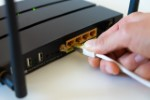

# Netzwerktechnik

## Grundkonzepte von Netzwerken beschreiben

### Arbeitsauftrag - Grundkonzepte von Netzwerken beschreiben

#### Aufgabe 1

Ein Netzwerk ist eine Verbindung von zwei oder mehr Computern oder anderen Geräten, die miteinander kommunizieren können, um Ressourcen und Informationen auszutauschen. Netzwerke können auf verschiedene Arten organisiert sein, und sie ermöglichen die gemeinsame Nutzung von Daten, Hardware und Diensten.

**Peer-to-Peer-Verbindung:**

- In einem Peer-to-Peer-Netzwerk sind alle Geräte gleichberechtigt (Peers) und können miteinander kommunizieren, ohne dass ein zentraler Server erforderlich ist.
- Jedes Gerät kann sowohl als Client (Anforderung von Ressourcen oder Diensten) als auch als Server (Bereitstellung von Ressourcen oder Diensten) fungieren.
- Typische Anwendungen von Peer-to-Peer-Netzwerken sind das gemeinsame Nutzen von Dateien zwischen Computern in einem kleinen Büro, die Dateien über das Internet teilen.

**Client-Server-Verbindung:**

- In einem Client-Server-Netzwerk gibt es eine klare Unterscheidung zwischen Clients und Servern. Die Server stellen Ressourcen oder Dienste zur Verfügung, während die Clients diese Ressourcen anfordern.
- Server sind in der Regel leistungsstärkere und speziell dafür konfigurierte Geräte, die Anfragen von Clients bearbeiten und Daten oder Dienste bereitstellen.
- Beispiele für Client-Server-Anwendungen sind Webserver (die Webseiten an Browser-Clients senden), E-Mail-Server (die E-Mails an E-Mail-Clients senden) und Datenbankserver (die Daten abrufbar machen).

#### Aufgabe 2

- **Ressourcenfreigabe:** Computer-Netzwerke ermöglichen die gemeinsame Nutzung von Hardware-Ressourcen wie Druckern, Scannern, Speichergeräten und anderen Peripheriegeräten. Dies reduziert die Anschaffungskosten und verhindert die Redundanz von Ressourcen.
- **Datenfreigabe:** Netzwerke ermöglichen die gemeinsame Nutzung und den Zugriff auf Dateien und Datenbanken, wodurch die Zusammenarbeit und der Datenaustausch in Unternehmen und zwischen Einzelpersonen vereinfacht werden.
- **Kommunikation:** Computer-Netzwerke bieten effiziente Kommunikationsmittel. E-Mail, Instant Messaging, Videoanrufe und VoIP sind Beispiele für Kommunikationsanwendungen, die von Netzwerken unterstützt werden.
- **Zugriff auf das Internet:** Netzwerke ermöglichen den Zugriff auf das World Wide Web und andere Online-Ressourcen. Dies ist für Recherche, E-Commerce, soziale Netzwerke und viele andere Aspekte des modernen Lebens von entscheidender Bedeutung.
- **Zentralisierte Verwaltung:** Netzwerke erleichtern die zentrale Verwaltung und Aktualisierung von Software, Sicherheitseinstellungen und anderen Aspekten der IT-Infrastruktur in Unternehmen.
- **Sicherheit:** Netzwerke ermöglichen die Implementierung von Sicherheitsmaßnahmen wie Firewalls, Verschlüsselung und Zugriffskontrollen, um Daten und Ressourcen zu schützen.
- **Skalierbarkeit:** Unternehmen können ihre Netzwerke einfach erweitern, wenn sie wachsen, ohne die gesamte Infrastruktur neu erstellen zu müssen.
- **Redundanz und Ausfallsicherheit:** Netzwerke können so konfiguriert werden, dass sie Redundanz und Ausfallsicherheit bieten, um sicherzustellen, dass wichtige Systeme auch im Falle eines Hardwarefehlers weiterhin verfügbar sind.
- **Remote-Zugriff:** Mit Netzwerken können Benutzer von entfernten Standorten aus auf Ressourcen und Daten zugreifen, was die Flexibilität und die Möglichkeit zur Fernarbeit erhöht.

#### Aufgabe 3

| Abbildung | Bezeichnung | Beschreibung |
| :---: | :--- | :--- |
|  | Router | Ein Router ist ein wesentliches Element in einem Netzwerk, da er den Datenverkehr zwischen verschiedenen Netzwerksegmenten, einschließlich lokaler Netzwerke (LANs) und dem Internet, steuert. Router bestimmen den besten Pfad für Datenpakete, um sie zu ihrem Ziel zu leiten. Die Hauptaufgabe ist das verbinden zweier Netzwerke miteinander. |
|  | Patch-Panel | Ein Patchpanel ist eine rechteckige oder quadratische Platte mit vielen Anschlüssen oder Ports. Es wird in der Regel in Serverräumen, Rechenzentren oder Verkabelungsschränken montiert. Die Ports des Patchpanels sind in der Regel standardisierte RJ45-Buchsen für Ethernet-Kabelverbindungen. Jeder Port auf dem Patchpanel ist mit einem spezifischen Kabel in einem Netzwerk verbunden. Das Patchpanel erleichtert die physische Verbindung von Geräten und die Organisation von Netzwerkkabeln |
|  | Switch | Ein Switch ist ein Gerät, das in lokalen Netzwerken (LANs) verwendet wird, um Datenpakete zwischen Geräten in einem Netzwerk weiterzuleiten. Switches sind in der Regel schneller als Hubs und unterstützen eine effiziente Kommunikation zwischen Geräten. |
|  | Hub | Ein Hub ist ein einfaches Gerät, das Datenpakete an alle angeschlossenen Geräte im Netzwerk sendet. Hubs werden heute selten eingesetzt, da sie weniger effizient sind als Switches. |
|  | Access Point (AP) | Ein Access Point ist ein Gerät, das drahtlose Netzwerke (WLANs) bereitstellt. Es ermöglicht drahtlosen Geräten, sich mit dem Netzwerk zu verbinden, um auf Ressourcen und das Internet zuzugreifen. |
|  | Modem | Ein Modem (Modulator-Demodulator) ermöglicht die Verbindung eines Netzwerks mit dem Internet über verschiedene Übertragungsmedien wie DSL, Kabel oder Glasfaser. Es wandelt digitale Daten in analoge Signale um und umgekehrt. |
|  | Netzwerkkarten (Network Interface Cards, NICs) | Netzwerkkarten sind Hardwarekomponenten, die in Computern und anderen Geräten eingebaut sind, um eine physische Verbindung zum Netzwerk herzustellen. Sie können drahtgebundene (Ethernet) oder drahtlose (WLAN) Verbindungen unterstützen. |
|  | (Hardware) Firewalls | Firewalls sind Sicherheitsgeräte, die den Datenverkehr überwachen und filtern, um unerwünschten Zugriff und schädliche Aktivitäten zu verhindern. Sie schützen Netzwerke vor Bedrohungen aus dem Internet. |
|  | Proxy-Server | Ein Proxy-Server fungiert als Vermittler zwischen internen Netzwerken und dem Internet. Er kann den Datenverkehr filtern, Zwischenspeicherung durchführen, Lastverteilungen durchführen und Sicherheitsfunktionen bereitstellen. |
|  | Kabel und Verkabelung | Die Auswahl der richtigen Kabel und Verkabelung ist entscheidend, um die physische Verbindung zwischen Geräten und Netzwerkkomponenten sicherzustellen. Dies umfasst Ethernet-Kabel (Cat5e, Cat6, Cat7), Glasfaserkabel und koaxiale Kabel. |
|  | Sicherheitsgeräte | Neben Firewalls umfassen Sicherheitsgeräte wie Intrusion Detection Systems (IDS) und Intrusion Prevention Systems (IPS) Hardwarekomponenten, die Netzwerke vor Sicherheitsbedrohungen schützen. |

#### Aufgabe 4

- **Preis:** Welches Budget steht zur Verfügung.
- **Geschäftsanforderungen:** Es ist entscheidend, die geschäftlichen Ziele und Anforderungen des Kunden zu verstehen. Welche Art von Diensten und Anwendungen sollen unterstützt werden? Welche Leistungsanforderungen gibt es?
- **Größe und Skalierbarkeit:** Berücksichtigen Sie die Größe des Netzwerks und die mögliche zukünftige Expansion. Das Netzwerk muss skalierbar sein, um mit dem Wachstum des Unternehmens Schritt zu halten.
- **Budget und Ressourcen:** Das Budget des Kunden und die verfügbaren Ressourcen sind wichtige Faktoren. Die Netzwerkplanung muss innerhalb des Budgets bleiben und die verfügbaren Ressourcen optimal nutzen.
- **Netzwerktopologie:** Die Auswahl der richtigen Netzwerktopologie (z.B. Stern, Bus, Ring, Mesh) hängt von den Anforderungen des Kunden ab. Die Topologie beeinflusst die Skalierbarkeit, Redundanz und Leistung des Netzwerks.
- **Verkabelung und Infrastruktur:** Die Auswahl der richtigen Art der Verkabelung (z. B. Kupfer- oder Glasfaserkabel) und die Gestaltung der Netzwerkinfrastruktur sind entscheidend für die Netzwerkzuverlässigkeit und -leistung.
- **Netzwerkprotokolle und -technologien:** Die Auswahl der richtigen Netzwerkprotokolle und -technologien (z. B. Ethernet, WLAN, VPN) hängt von den spezifischen Anforderungen des Kunden ab.
- **Sicherheit:** Die Sicherheit des Netzwerks ist von entscheidender Bedeutung. Berücksichtigen Sie die Sicherheitsanforderungen des Kunden, um das Netzwerk vor Bedrohungen zu schützen.
- **QoS (Quality of Service):** Wenn das Netzwerk Sprach- oder Videokommunikation unterstützen soll, ist die Implementierung von QoS wichtig, um eine hohe Qualität und geringe Latenzzeiten sicherzustellen.
- **Redundanz und Ausfallsicherheit:** Planen Sie Redundanzmechanismen, um sicherzustellen, dass das Netzwerk bei Ausfällen oder Störungen weiterhin funktioniert. Lastverteilung im Netzwerk sollte ebenfalls berücksichtigt werden.
- **Drahtlos oder kabelgebunden:**
Entscheiden Sie, ob das Netzwerk drahtlos oder kabelgebunden sein soll, und berücksichtigen Sie die Abdeckung und Leistung von WLAN in verschiedenen Bereichen.
- **Verwaltung und Wartung:** Denken Sie an Netzwerkmanagementtools und -prozesse, um das Netzwerk effizient zu verwalten und Wartungsarbeiten durchzuführen.
- **Rechtsvorschriften und Compliance:** Stellen Sie sicher, dass das Netzwerk den geltenden gesetzlichen Bestimmungen und Compliance-Anforderungen entspricht.
- **Benutzerzugriff und Berechtigungen:** Planen Sie die Zugriffsrechte und Berechtigungen sorgfältig, um sicherzustellen, dass Benutzer nur auf die für sie relevanten Ressourcen zugreifen können.

## Clients einem Netzwerk hinzufügen

### Arbeitsauftrag - Clients einem Netzwerk hinzufügen

#### Aufgabe 1

- **IP-Adresse:** Der Netzwerk-Client benötigt eine eindeutige IP-Adresse, um im Netzwerk identifiziert zu werden. Diese Adresse kann statisch (manuell konfiguriert) oder dynamisch (durch DHCP) zugewiesen werden.
- **Subnetzmaske:** Die Subnetzmaske wird verwendet, um festzulegen, welcher Bereich von IP-Adressen im Netzwerk lokal erreichbar ist. Sie bestimmt die Netzwerkteilung und die IP-Bereiche, die im selben Subnetz liegen.
- **Gateway-Adresse:** Das Gateway ist die IP-Adresse des Routers, der den Netzwerkverkehr zwischen dem lokalen Netzwerk und anderen Netzwerken, wie dem Internet, vermittelt. Der Netzwerk-Client muss wissen, welche IP-Adresse als Gateway verwendet wird.
- **DNS-Server-Adresse:** Der DNS-Server (Domain Name System) wird verwendet, um Domainnamen in IP-Adressen aufzulösen. Der Netzwerk-Client benötigt mindestens eine DNS-Server-Adresse, um Internetdienste und Ressourcen im Netzwerk anhand von Namen statt IP-Adressen zu erreichen.

#### Aufgabe 2

Ein DHCP-Server (Dynamic Host Configuration Protocol) übernimmt in einem Netzwerk verschiedene Aufgaben in Bezug auf die Zuweisung von IP-Adressen und anderen Netzwerkkonfigurationsinformationen an angeschlossene Clients.

- **IP-Adresszuweisung:** Der DHCP-Server weist IP-Adressen an Netzwerkclients dynamisch zu. Dies bedeutet, dass er Clients bei Bedarf eine freie IP-Adresse aus einem vordefinierten Adresspool zuweist. Dies erleichtert die Verwaltung von IP-Adressen im Netzwerk, da keine manuelle Konfiguration erforderlich ist.
- **Subnetzmaskenzuweisung:** Der DHCP-Server weist den Clients auch die passende Subnetzmaske zu, um festzulegen, welcher Bereich von IP-Adressen im lokalen Netzwerk erreichbar ist.
- **Gateway-Informationen:** Der DHCP-Server teilt den Clients die IP-Adresse des Standardgateways mit, das für die Weiterleitung von Datenverkehr außerhalb des lokalen Netzwerks verwendet wird.
- **DNS-Server-Informationen:** Der DHCP-Server gibt den Clients die IP-Adressen der DNS-Server im Netzwerk, die zur Auflösung von Domainnamen in IP-Adressen benötigt werden.
- **Weitere Konfigurationsoptionen:** DHCP kann auch zusätzliche Informationen wie Zeitserver, NTP-Server, WINS-Server und spezielle DHCP-Optionen bereitstellen, die von den Clients verwendet werden können.
- **Leasemanagement:** DHCP-Server weisen IP-Adressen auf Zeitbasis zu. Clients erhalten eine temporäre Leasetime für die zugewiesene IP-Adresse, und der DHCP-Server aktualisiert oder erneuert die Leases, wenn sie ablaufen. Dies ermöglicht die effiziente Nutzung von IP-Adressen, da nicht verwendete Adressen freigegeben werden.
- **Fehlerbehandlung:** Der DHCP-Server kann Fehler behandeln, wie z.B. IP-Adresskonflikte, die auftreten können, wenn eine bereits verwendete IP-Adresse erneut zugewiesen wird.

#### Aufgabe 3

**Für Windows-Systeme:**

1. Öffnen Sie die Eingabeaufforderung (CMD): Klicken Sie auf "Start", geben Sie "cmd" in das Suchfeld ein und drücken Sie "Enter". Dies öffnet das Eingabeaufforderungsfenster.
2. Geben Sie den Befehl "ipconfig" ein und drücken Sie "Enter". Dieser Befehl zeigt Ihnen Informationen zur Netzwerkkonfiguration Ihres Windows-Systems, einschließlich Ihrer IP-Adresse, Subnetzmaske, Standardgateway und DNS-Server.
3. Für weitere Details können Sie "ipconfig /all" eingeben. Dies zeigt erweiterte Informationen, einschließlich Ihrer MAC-Adresse und DHCP-Konfiguration.
4. Wenn Sie Informationen zur Netzwerkkarte benötigen, können Sie den Befehl "netsh interface show interface" verwenden, um Details zur Netzwerkschnittstelle anzuzeigen.

**Für Linux-Systeme:**

1. Öffnen Sie das Terminal: Je nach Ihrem Linux-Desktop-Umgebung können Sie das Terminal über das Anwendungsmenü oder mit einer Tastenkombination öffnen.
2. Geben Sie den Befehl "ifconfig" ein und drücken Sie "Enter". Dieser Befehl zeigt Informationen zur Netzwerkkonfiguration Ihres Linux-Systems, einschließlich Ihrer IP-Adresse, Subnetzmaske und MAC-Adresse.
3. Für neuere Linux-Distributionen oder solche, die das "ip" -Befehlszeilenwerkzeug verwenden, können Sie "ip addr show" verwenden, um ähnliche Informationen anzuzeigen.
4. Wenn Sie weitere Netzwerkinformationen benötigen, können Sie "route -n" verwenden, um Details zu Ihrer Routing-Tabelle anzuzeigen.
5. Für erweiterte Informationen und Konfigurationen können Sie je nach Linux-Distribution das Network Manager-Tool oder das "nmcli" -Befehlszeilenwerkzeug verwenden.

#### Aufgabe 4

Um die Netzwerkverbindung zu einem anderen Client im Netzwerk zu testen, können Sie den "ping" -Befehl verwenden. Dieser Befehl wird verwendet, um festzustellen, ob ein Remote-Host (in diesem Fall der Ziel-Client mit der IP-Adresse 192.168.178.2) erreichbar ist.

`> ping 192.168.178.2`

Wenn der Ziel-Client erreichbar ist und die Verbindung ordnungsgemäß funktioniert, erhalten Sie eine Antwort vom Ziel-Client in Form von ICMP-Echo-Antworten. Wenn Sie keine Antwort erhalten oder "Zeitüberschreitung" oder "Host nicht erreichbar" sehen, bedeutet dies, dass es ein Problem mit der Verbindung zum Ziel-Client gibt.

#### Aufgabe 5

Für private Netzwerke werden spezielle IP-Adressbereiche verwendet, die in den folgenden RFC-Dokumenten (Request for Comments) festgelegt sind, um Konflikte mit öffentlichen IP-Adressen im Internet zu vermeiden. Diese privaten IP-Adressbereiche sind für die Verwendung in privaten Netzwerken und lokalen Netzwerken reserviert:

**IPv4-Adressbereiche für private Netze:**

- **10.0.0.0 bis 10.255.255.255 (10.0.0.0/8):** Dieser Bereich umfasst 16.777.216 IP-Adressen und ist für größere private Netzwerke geeignet.
- **172.16.0.0 bis 172.31.255.255 (172.16.0.0/12):** Dieser Bereich umfasst 1.048.576 IP-Adressen und wird häufig in mittelgroßen Netzwerken verwendet.
- **192.168.0.0 bis 192.168.255.255 (192.168.0.0/16):** Dieser Bereich bietet 65.536 IP-Adressen und ist für kleinere Netzwerke oder Heimnetzwerke geeignet.

**IPv6-Adressbereiche für private Netze:**

- **fc00::/7:** Dieser Bereich ist für IPv6-Adressen in privaten Netzwerken reserviert. Innerhalb dieses Bereichs können private IPv6-Adressbereiche erstellt werden, um die Adressierung in lokalen Netzwerken zu ermöglichen.

## OSI-Modell nutzen

#### Aufgabe 1

| Layer-Nr. | Englischer Name          | Deutscher Name            | Aufgaben der Schicht                                         |
|-----------|--------------------------|---------------------------|--------------------------------------------------------------|
| 7         | Application              | Anwendung                 | Bereitstellung von Netzwerkdiensten für Anwendungen          |
| 6         | Presentation             | Darstellung               | Datenübersetzung, Verschlüsselung und Kompression            |
| 5         | Session                  | Sitzung                   | Aufrechterhaltung und Beendigung von Kommunikationssitzungen |
| 4         | Transport                | Transport                 | Zuverlässiger Datenaustausch und Flusskontrolle              |
| 3         | Network                  | Netzwerk                  | Routing, Logische Adressierung, Paketweiterleitung           |
| 2         | Data Link                | Sicherung                 | Zuverlässige Datenübertragung im lokalen Netzwerk            |
| 1         | Physical                 | Bitübertragungsschicht    | Physikalische Verbindung und Bitübertragung                  |

#### Aufgabe 2

- **Standardisierung:**
   - *Ziel:* Eine gemeinsame Basis für die Entwicklung von Netzwerktechnologien schaffen.
   - *Erläuterung:* Das OSI-Referenzmodell bietet einen Rahmen für die Standardisierung von Netzwerkprotokollen und -technologien. Dies ermöglicht die Interoperabilität verschiedener Systeme und Geräte, die auf der ganzen Welt entwickelt werden.
- **Klare Strukturierung:**
   - *Ziel:* Die Komplexität von Netzwerken in überschaubare Schichten unterteilen.
   - *Erläuterung:* Das Modell organisiert Netzwerkfunktionalitäten in sieben klar definierte Schichten. Dies erleichtert das Verständnis, die Entwicklung und den Betrieb von Netzwerklösungen, indem komplexe Aufgaben in leichter handhabbare Teile zerlegt werden.
- **Fehlerisolierung und -behebung:**
   - *Ziel:* Die Lokalisierung von Fehlern in Netzwerken vereinfachen.
   - *Erläuterung:* Durch die klare Schichtstruktur des OSI-Modells kann bei Netzwerkproblemen leichter identifiziert werden, in welcher Schicht der Fehler auftritt. Dies erleichtert die Fehlerdiagnose und -behebung.
- **Förderung von Interoperabilität:**
   - *Ziel:* Die Kommunikation zwischen unterschiedlichen Systemen und Technologien ermöglichen.
   - *Erläuterung:* Das OSI-Modell fördert die Interoperabilität, da es als Referenzrahmen dient, dem verschiedene Hersteller bei der Entwicklung ihrer Netzwerkprodukte folgen können. Dadurch wird die nahtlose Integration von Produkten unterschiedlicher Hersteller erleichtert.

#### Aufgabe 3

1. **Bitübertragungsschicht (Physical Layer):**
   - *Aufgaben:* Übertragung von Bitfolgen über physikalische Medien (Kabel, Funkwellen).
   - *Genutzte Pakete:* Bits.
   - *Mögliche Fehler:* Signalverlust, Rauschen, Physische Kabelprobleme.
2. **Sicherungsschicht (Data Link Layer):**
   - *Aufgaben:* Zuverlässige Übertragung von Frames zwischen direkt benachbarten Knoten. Adressierung, Fehlererkennung und -korrektur.
   - *Genutzte Pakete:* Frames.
   - *Mögliche Fehler:* Kollisionen, verlorene Frames, Duplikate.
3. **Netzwerkschicht (Network Layer):**
   - *Aufgaben:* Logische Adressierung, Routing von Paketen zwischen verschiedenen Netzwerken, Paketweiterleitung.
   - *Genutzte Pakete:* Pakete.
   - *Mögliche Fehler:* Fehlerrate bei der Weiterleitung, Routing-Probleme.
4. **Transportschicht (Transport Layer):**
   - *Aufgaben:* Segmentierung von Daten in kleinere Einheiten, Flusskontrolle, Zuverlässige Übertragung von Daten zwischen Endsystemen.
   - *Genutzte Pakete:* Segmente.
   - *Mögliche Fehler:* Datenverlust, Überlastung, fehlerhafte Reihenfolge der Segmente.
5. **Sitzungsschicht (Session Layer):**
   - *Aufgaben:* Aufrechterhaltung und Beendigung von Sitzungen, Synchronisation von Datenübertragung.
   - *Genutzte Pakete:* Keine eigenen Pakete, verwendet die Dienste der darunterliegenden Schichten.
   - *Mögliche Fehler:* Sitzungsabbruch, Probleme bei der Synchronisation.
6. **Darstellungsschicht (Presentation Layer):**
   - *Aufgaben:* Datenübersetzung, Verschlüsselung, Kompression, Umwandlung von Datenformaten.
   - *Genutzte Pakete:* Keine eigenen Pakete, verwendet die Dienste der darunterliegenden Schichten.
   - *Mögliche Fehler:* Probleme bei der Datenübersetzung, Dekodierung oder Verschlüsselung.
7. **Anwendungsschicht (Application Layer):**
   - *Aufgaben:* Bereitstellung von Netzwerkdiensten für Anwendungen, Nutzerinteraktion.
   - *Genutzte Pakete:* Nutzerdaten.
   - *Mögliche Fehler:* Anwendungsfehler, unerwartetes Verhalten von Anwendungen.

## Wichtige Protokolle zuordnen

#### Aufgabe 1

| Protokoll | OSI-Schicht | Ausgeschriebener Name | Beschreibung                                                   |
|-----------|-------------|-----------------------|---------------------------------------------------------------|
| DNS       | Anwendung   | Domain Name System    | Übersetzt Hostnamen in IP-Adressen und umgekehrt.             |
| SMB       | Sicherung   | Server Message Block  | Protokoll für die Datei- und Druckerfreigabe in Netzwerken.    |
| NFS       | Anwendung   | Network File System   | Ermöglicht den Zugriff auf Dateien über ein Netzwerk.         |
| SMTP/S    | Anwendung   | Simple Mail Transfer Protocol/Secure | Überträgt E-Mails zwischen Servern.            |
| HTTP/S    | Anwendung   | Hypertext Transfer Protocol/Secure | Überträgt Webseiteninhalte über das Internet.            |
| IPSEC     | Sicherung   | IP Security           | Bietet Sicherheit für die Kommunikation auf Netzwerkschicht.  |
| IP        | Netzwerk    | Internet Protocol     | Ermöglicht die Übertragung von Datenpaketen im Netzwerk.      |
| TCP       | Transport   | Transmission Control Protocol | Gewährleistet zuverlässige, geordnete Datenübertragung.     |
| UDP       | Transport   | User Datagram Protocol | Überträgt Daten ohne Bestätigung oder Verbindungsaufbau.     |
| SSH       | Anwendung   | Secure Shell          | Sichert die Kommunikation über unsichere Netzwerke.          |
| DHCP      | Anwendung   | Dynamic Host Configuration Protocol | Automatisiert die Vergabe von Netzwerkkonfigurationen. |
| ARP       | Sicherung   | Address Resolution Protocol | Ermittelt die Hardwareadresse zu einer IP-Adresse im lokalen Netzwerk. |
| TLS       | Sicherung   | Transport Layer Security | Gewährleistet sichere Datenübertragung über das Internet.    |

#### Aufgabe 2

**Allgemein**

- **Benutzername und Passwort:**
   - *Benutzername:* Die E-Mail-Adresse des Kontos, z.B. "benutzername@example.com".
   - *Passwort:* Das Passwort, das mit dem E-Mail-Konto verknüpft ist.
- **E-Mail-Protokoll und Serverinformationen:**
   - *E-Mail-Protokoll:* IMAP (Internet Message Access Protocol) oder POP3 (Post Office Protocol).
   - *Eingangsserver (IMAP/POP3):* z.B. "imap.example.com" oder "pop.example.com".
   - *Ausgangsserver (SMTP):* z.B. "smtp.example.com".
- **Verschlüsselungsmethoden:**
   - *SSL/TLS:* Informationen darüber, ob SSL (Secure Sockets Layer) oder TLS (Transport Layer Security) für die Verschlüsselung verwendet werden sollen. Dies betrifft sowohl den Eingangs- als auch den Ausgangsserver.
- **Portnummern:**
   - IMAP-Port: Normalerweise 143 (unverschlüsselt) oder 993 (verschlüsselt).
   - POP3-Port: Normalerweise 110 (unverschlüsselt) oder 995 (verschlüsselt).
   - SMTP-Port: Normalerweise 25 (unverschlüsselt), 587 (verschlüsselt), oder 465 (verschlüsselt).
- **Authentifizierungsmethode:**
   - Informationen darüber, ob die Authentifizierung über Passwort, OAuth (Open Authorization) oder ein anderes Verfahren erfolgt.
- **Domaininformationen (falls zutreffend):**
   - Manchmal erfordern bestimmte E-Mail-Anbieter die Eingabe der Domäne, z.B. "example.com".

**E-Mail-Konfiguration für die MMBbS:**

- Empfangsserver (IMAP): mail.mm-bbs.de
- Server-Port (IMAP): 143
- Sendeserver (SMTP): mail.mm-bbs.de
- Server-Port (SMTP): 25
- Benutzername: Ihre E-Mail Adresse (@mm-bbs.de)
- Passwort: Ihr Portal (WLAN) Passwort
- Verschlüsselung: STARTTLS

#### Aufgabe 3

**HTTP (Hypertext Transfer Protocol):**

- **Nicht sicher:** HTTP ist ein unverschlüsseltes Protokoll, was bedeutet, dass die Daten, die zwischen dem Webserver und dem Browser übertragen werden, in Klartext lesbar sind.
  
- **Port:** HTTP verwendet normalerweise Port 80 für die Kommunikation.

- **Keine Authentifizierung:** HTTP bietet keine integrierte Möglichkeit zur Authentifizierung von Servern oder Clients.

**HTTPS (Hypertext Transfer Protocol Secure):**

- **Sicher:** HTTPS ist die sichere Version von HTTP. Hierbei werden die Daten zwischen dem Webserver und dem Browser verschlüsselt, was die Vertraulichkeit und Integrität der übertragenen Daten gewährleistet.

- **Verschlüsselung:** HTTPS verwendet SSL (Secure Sockets Layer) oder das modernere TLS (Transport Layer Security) zur Verschlüsselung der Datenübertragung.

- **Port:** HTTPS verwendet normalerweise Port 443 für die Kommunikation.

- **Authentifizierung:** HTTPS ermöglicht die Authentifizierung des Servers durch digitale Zertifikate. Dadurch kann der Browser sicherstellen, dass er mit dem tatsächlichen Server und nicht mit einem potenziell bösartigen Server verbunden ist.

**SSL (Secure Sockets Layer) Verschlüsselung:**

Die SSL-Verschlüsselung, die jetzt oft durch das sicherere TLS-Protokoll ersetzt wurde, funktioniert folgendermaßen:

1. **Handshake:** Der SSL/TLS-Handshake ist der Prozess, bei dem der Server und der Client sich auf die Verschlüsselungsmethoden einigen und die erforderlichen Schlüssel austauschen. Dies beinhaltet auch die Überprüfung der Integrität der erhaltenen Zertifikate.

2. **Verschlüsselung:** Nach dem Handshake wird eine sichere Verbindung hergestellt, und die Datenübertragung zwischen Server und Client erfolgt verschlüsselt. Dies bedeutet, dass selbst wenn ein Angreifer die übertragenen Daten abfängt, er sie nicht ohne den richtigen Schlüssel entschlüsseln kann.

3. **Entschlüsselung beim Empfänger:** Der Empfänger (Server oder Client) entschlüsselt die empfangenen Daten mit dem entsprechenden Schlüssel, um sie im Klartext zu erhalten.

SSL/TLS bietet somit eine sichere Kommunikation über unsichere Netzwerke wie das Internet, indem es die Vertraulichkeit, Integrität und Authentizität der übertragenen Daten gewährleistet.

#### Aufgabe 4

HTTPS-Inspection, auch als HTTPS Interception oder SSL/TLS Inspection bekannt, bezieht sich auf einen Prozess, bei dem der Inhalt von verschlüsselten HTTPS-Verbindungen von einem Sicherheitsgerät (z.B., Firewalls, Proxy-Server, Content-Filter) entschlüsselt, inspiziert und anschließend wieder verschlüsselt wird, bevor er an den ursprünglichen Empfänger gesendet wird. Dieser Vorgang wird oft in Unternehmensnetzwerken und Sicherheitsinfrastrukturen eingesetzt, um die Sicherheit und Kontrolle über den Datenverkehr zu erhöhen.

Hier sind die grundlegenden Schritte des HTTPS-Inspection-Prozesses:

1. **Entschlüsselung des HTTPS-Verkehrs:**
   - Das Sicherheitsgerät, das HTTPS-Inspection durchführt, fungiert als sogenannter "Man-in-the-Middle". Es empfängt die verschlüsselten Daten, entschlüsselt sie und kann somit den Klartextinhalt einsehen.

2. **Inspektion des Datenverkehrs:**
   - Der entschlüsselte Datenverkehr wird vom Sicherheitsgerät inspiziert. Dies kann verschiedene Sicherheitsmaßnahmen umfassen, wie das Überprüfen auf schädliche Inhalte, Filtern unerwünschter Websites, Implementierung von Sicherheitsrichtlinien oder Überwachung der Aktivitäten im Netzwerk.

3. **Wieder-Verschlüsselung und Weiterleitung:**
   - Nachdem der Datenverkehr inspiziert wurde, wird er vom Sicherheitsgerät wieder verschlüsselt, um die ursprüngliche Verschlüsselung beizubehalten. Anschließend wird der Datenverkehr an das ursprüngliche Ziel (z.B., Webserver) weitergeleitet.

Die Gründe für die Implementierung von HTTPS-Inspection können sein:

- **Sicherheitskontrolle:** Die Möglichkeit, verschlüsselten Datenverkehr zu inspizieren, ermöglicht es Sicherheitslösungen, bösartige Aktivitäten zu erkennen, schädliche Inhalte zu blockieren und Sicherheitsrichtlinien durchzusetzen.

- **Compliance:** In einigen Branchen und Organisationen sind Sicherheitsüberprüfungen und Kontrollen erforderlich, um bestimmten Compliance-Anforderungen zu entsprechen.

**Soziale und sicherheitsbezogene Gesichtspunkte**

HTTPS-Inspection hat auch kontroverse Aspekte, insbesondere im Hinblick auf die Privatsphäre. Da es eine Entschlüsselung des Datenverkehrs erfordert, kann dies zu Bedenken hinsichtlich der Vertraulichkeit und des Datenschutzes führen. Daher sollte der Einsatz von HTTPS-Inspection sorgfältig abgewogen und transparent kommuniziert werden, um die Erwartungen der Benutzer in Bezug auf Privatsphäre zu berücksichtigen.

Die Entschlüsselung und Inspektion des HTTPS-Verkehrs durch HTTPS-Inspection-Punkte kann potenziell von Angreifern ausgenutzt werden, wenn nicht angemessen implementiert und geschützt. Eine der bekannteren Methoden stellen die Man-in-the-Middle-Angriffe (MitM) dar. Ein Angreifer könnte versuchen, die Rolle des "Man-in-the-Middle" zu übernehmen, indem er die Entschlüsselungspunkte im HTTPS-Inspection-System ausnutzt. Dies könnte durch falsche Zertifikate oder Schwächen in der Implementierung erreicht werden.