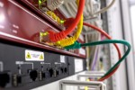

# Netzwerktechnik

## Grundkonzepte von Netzwerken beschreiben

### Arbeitsauftrag - Grundkonzepte von Netzwerken beschreiben

#### Aufgabe 1

Ein Netzwerk ist eine Verbindung von zwei oder mehr Computern oder anderen Geräten, die miteinander kommunizieren können, um Ressourcen und Informationen auszutauschen. Netzwerke können auf verschiedene Arten organisiert sein, und sie ermöglichen die gemeinsame Nutzung von Daten, Hardware und Diensten.

**Peer-to-Peer-Verbindung:**

- In einem Peer-to-Peer-Netzwerk sind alle Geräte gleichberechtigt (Peers) und können miteinander kommunizieren, ohne dass ein zentraler Server erforderlich ist.
- Jedes Gerät kann sowohl als Client (Anforderung von Ressourcen oder Diensten) als auch als Server (Bereitstellung von Ressourcen oder Diensten) fungieren.
- Typische Anwendungen von Peer-to-Peer-Netzwerken sind das gemeinsame Nutzen von Dateien zwischen Computern in einem kleinen Büro, die Dateien über das Internet teilen.

**Client-Server-Verbindung:**

- In einem Client-Server-Netzwerk gibt es eine klare Unterscheidung zwischen Clients und Servern. Die Server stellen Ressourcen oder Dienste zur Verfügung, während die Clients diese Ressourcen anfordern.
- Server sind in der Regel leistungsstärkere und speziell dafür konfigurierte Geräte, die Anfragen von Clients bearbeiten und Daten oder Dienste bereitstellen.
- Beispiele für Client-Server-Anwendungen sind Webserver (die Webseiten an Browser-Clients senden), E-Mail-Server (die E-Mails an E-Mail-Clients senden) und Datenbankserver (die Daten abrufbar machen).

#### Aufgabe 2

- **Ressourcenfreigabe:** Computer-Netzwerke ermöglichen die gemeinsame Nutzung von Hardware-Ressourcen wie Druckern, Scannern, Speichergeräten und anderen Peripheriegeräten. Dies reduziert die Anschaffungskosten und verhindert die Redundanz von Ressourcen.
- **Datenfreigabe:** Netzwerke ermöglichen die gemeinsame Nutzung und den Zugriff auf Dateien und Datenbanken, wodurch die Zusammenarbeit und der Datenaustausch in Unternehmen und zwischen Einzelpersonen vereinfacht werden.
- **Kommunikation:** Computer-Netzwerke bieten effiziente Kommunikationsmittel. E-Mail, Instant Messaging, Videoanrufe und VoIP sind Beispiele für Kommunikationsanwendungen, die von Netzwerken unterstützt werden.
- **Zugriff auf das Internet:** Netzwerke ermöglichen den Zugriff auf das World Wide Web und andere Online-Ressourcen. Dies ist für Recherche, E-Commerce, soziale Netzwerke und viele andere Aspekte des modernen Lebens von entscheidender Bedeutung.
- **Zentralisierte Verwaltung:** Netzwerke erleichtern die zentrale Verwaltung und Aktualisierung von Software, Sicherheitseinstellungen und anderen Aspekten der IT-Infrastruktur in Unternehmen.
- **Sicherheit:** Netzwerke ermöglichen die Implementierung von Sicherheitsmaßnahmen wie Firewalls, Verschlüsselung und Zugriffskontrollen, um Daten und Ressourcen zu schützen.
- **Skalierbarkeit:** Unternehmen können ihre Netzwerke einfach erweitern, wenn sie wachsen, ohne die gesamte Infrastruktur neu erstellen zu müssen.
- **Redundanz und Ausfallsicherheit:** Netzwerke können so konfiguriert werden, dass sie Redundanz und Ausfallsicherheit bieten, um sicherzustellen, dass wichtige Systeme auch im Falle eines Hardwarefehlers weiterhin verfügbar sind.
- **Remote-Zugriff:** Mit Netzwerken können Benutzer von entfernten Standorten aus auf Ressourcen und Daten zugreifen, was die Flexibilität und die Möglichkeit zur Fernarbeit erhöht.

#### Aufgabe 3

| Abbildung | Bezeichnung | Beschreibung |
| :---: | :--- | :--- |
|  | Router | Ein Router ist ein wesentliches Element in einem Netzwerk, da er den Datenverkehr zwischen verschiedenen Netzwerksegmenten, einschließlich lokaler Netzwerke (LANs) und dem Internet, steuert. Router bestimmen den besten Pfad für Datenpakete, um sie zu ihrem Ziel zu leiten. Die Hauptaufgabe ist das verbinden zweier Netzwerke miteinander. |
|  | Patch-Panel | Ein Patchpanel ist eine rechteckige oder quadratische Platte mit vielen Anschlüssen oder Ports. Es wird in der Regel in Serverräumen, Rechenzentren oder Verkabelungsschränken montiert. Die Ports des Patchpanels sind in der Regel standardisierte RJ45-Buchsen für Ethernet-Kabelverbindungen. Jeder Port auf dem Patchpanel ist mit einem spezifischen Kabel in einem Netzwerk verbunden. Das Patchpanel erleichtert die physische Verbindung von Geräten und die Organisation von Netzwerkkabeln |
|  | Switch | Ein Switch ist ein Gerät, das in lokalen Netzwerken (LANs) verwendet wird, um Datenpakete zwischen Geräten in einem Netzwerk weiterzuleiten. Switches sind in der Regel schneller als Hubs und unterstützen eine effiziente Kommunikation zwischen Geräten. |
|  | Hub | Ein Hub ist ein einfaches Gerät, das Datenpakete an alle angeschlossenen Geräte im Netzwerk sendet. Hubs werden heute selten eingesetzt, da sie weniger effizient sind als Switches. |
|  | Access Point (AP) | Ein Access Point ist ein Gerät, das drahtlose Netzwerke (WLANs) bereitstellt. Es ermöglicht drahtlosen Geräten, sich mit dem Netzwerk zu verbinden, um auf Ressourcen und das Internet zuzugreifen. |
|  | Modem | Ein Modem (Modulator-Demodulator) ermöglicht die Verbindung eines Netzwerks mit dem Internet über verschiedene Übertragungsmedien wie DSL, Kabel oder Glasfaser. Es wandelt digitale Daten in analoge Signale um und umgekehrt. |
|  | Netzwerkkarten (Network Interface Cards, NICs) | Netzwerkkarten sind Hardwarekomponenten, die in Computern und anderen Geräten eingebaut sind, um eine physische Verbindung zum Netzwerk herzustellen. Sie können drahtgebundene (Ethernet) oder drahtlose (WLAN) Verbindungen unterstützen. |
|  | (Hardware) Firewalls | Firewalls sind Sicherheitsgeräte, die den Datenverkehr überwachen und filtern, um unerwünschten Zugriff und schädliche Aktivitäten zu verhindern. Sie schützen Netzwerke vor Bedrohungen aus dem Internet. |
|  | Proxy-Server | Ein Proxy-Server fungiert als Vermittler zwischen internen Netzwerken und dem Internet. Er kann den Datenverkehr filtern, Zwischenspeicherung durchführen, Lastverteilungen durchführen und Sicherheitsfunktionen bereitstellen. |
|  | Kabel und Verkabelung | Die Auswahl der richtigen Kabel und Verkabelung ist entscheidend, um die physische Verbindung zwischen Geräten und Netzwerkkomponenten sicherzustellen. Dies umfasst Ethernet-Kabel (Cat5e, Cat6, Cat7), Glasfaserkabel und koaxiale Kabel. |
|  | Sicherheitsgeräte | Neben Firewalls umfassen Sicherheitsgeräte wie Intrusion Detection Systems (IDS) und Intrusion Prevention Systems (IPS) Hardwarekomponenten, die Netzwerke vor Sicherheitsbedrohungen schützen. |

#### Aufgabe 4

- **Preis:** Welches Budget steht zur Verfügung.
- **Geschäftsanforderungen:** Es ist entscheidend, die geschäftlichen Ziele und Anforderungen des Kunden zu verstehen. Welche Art von Diensten und Anwendungen sollen unterstützt werden? Welche Leistungsanforderungen gibt es?
- **Größe und Skalierbarkeit:** Berücksichtigen Sie die Größe des Netzwerks und die mögliche zukünftige Expansion. Das Netzwerk muss skalierbar sein, um mit dem Wachstum des Unternehmens Schritt zu halten.
- **Budget und Ressourcen:** Das Budget des Kunden und die verfügbaren Ressourcen sind wichtige Faktoren. Die Netzwerkplanung muss innerhalb des Budgets bleiben und die verfügbaren Ressourcen optimal nutzen.
- **Netzwerktopologie:** Die Auswahl der richtigen Netzwerktopologie (z.B. Stern, Bus, Ring, Mesh) hängt von den Anforderungen des Kunden ab. Die Topologie beeinflusst die Skalierbarkeit, Redundanz und Leistung des Netzwerks.
- **Verkabelung und Infrastruktur:** Die Auswahl der richtigen Art der Verkabelung (z. B. Kupfer- oder Glasfaserkabel) und die Gestaltung der Netzwerkinfrastruktur sind entscheidend für die Netzwerkzuverlässigkeit und -leistung.
- **Netzwerkprotokolle und -technologien:** Die Auswahl der richtigen Netzwerkprotokolle und -technologien (z. B. Ethernet, WLAN, VPN) hängt von den spezifischen Anforderungen des Kunden ab.
- **Sicherheit:** Die Sicherheit des Netzwerks ist von entscheidender Bedeutung. Berücksichtigen Sie die Sicherheitsanforderungen des Kunden, um das Netzwerk vor Bedrohungen zu schützen.
- **QoS (Quality of Service):** Wenn das Netzwerk Sprach- oder Videokommunikation unterstützen soll, ist die Implementierung von QoS wichtig, um eine hohe Qualität und geringe Latenzzeiten sicherzustellen.
- **Redundanz und Ausfallsicherheit:** Planen Sie Redundanzmechanismen, um sicherzustellen, dass das Netzwerk bei Ausfällen oder Störungen weiterhin funktioniert. Lastverteilung im Netzwerk sollte ebenfalls berücksichtigt werden.
- **Drahtlos oder kabelgebunden:**
Entscheiden Sie, ob das Netzwerk drahtlos oder kabelgebunden sein soll, und berücksichtigen Sie die Abdeckung und Leistung von WLAN in verschiedenen Bereichen.
- **Verwaltung und Wartung:** Denken Sie an Netzwerkmanagementtools und -prozesse, um das Netzwerk effizient zu verwalten und Wartungsarbeiten durchzuführen.
- **Rechtsvorschriften und Compliance:** Stellen Sie sicher, dass das Netzwerk den geltenden gesetzlichen Bestimmungen und Compliance-Anforderungen entspricht.
- **Benutzerzugriff und Berechtigungen:** Planen Sie die Zugriffsrechte und Berechtigungen sorgfältig, um sicherzustellen, dass Benutzer nur auf die für sie relevanten Ressourcen zugreifen können.