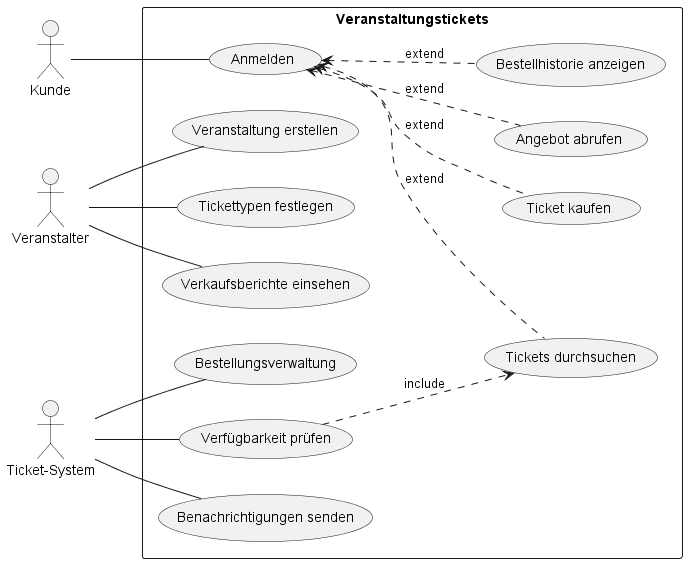
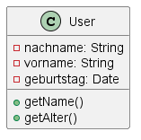
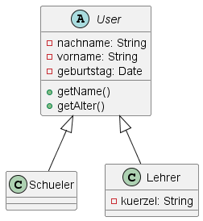
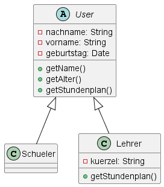
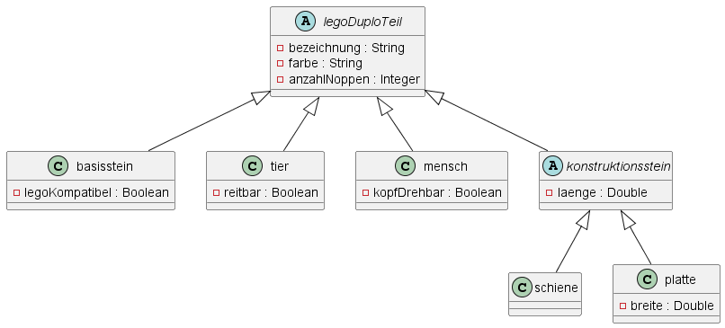
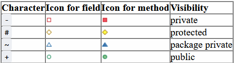
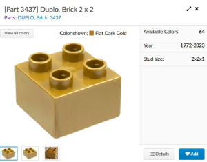

# Anwendungsentwicklung

## UML-Anwendungsfalldiagramme erstellen

### Arbeitsauftrag - UML-Anwendungsfalldiagramme erstellen

#### Aufgabe 1

Das UML-Anwendungsfalldiagramm ist in der objektorientierten Programmierung (OOP) ein wichtiges Werkzeug zur Modellierung und Visualisierung der funktionalen Anforderungen eines Systems. Es dient dazu, die verschiedenen Funktionen oder Aufgaben (Anwendungsfälle) zu identifizieren, die ein System für seine Benutzer oder externe Systeme bereitstellen soll.

1. **Identifikation von Anwendungsfällen:** Das Anwendungsfalldiagramm hilft dabei, die verschiedenen Aktivitäten oder Aufgaben zu identifizieren, die ein System für Benutzer oder externe Systeme ausführt.
2. **Darstellung von Benutzerinteraktionen:** Es visualisiert die Interaktionen zwischen den Benutzern (Akteuren) und dem System. Das zeigt, wie die Benutzer mit dem System agieren und welche Funktionen sie ausführen können.
3. **Definition von Systemgrenzen:** Das Diagramm hilft dabei, klare Grenzen für das System zu setzen, indem es zeigt, wer die Hauptakteure sind und welche Aufgaben innerhalb des Systems durchgeführt werden.
4. **Festlegung von Systemfunktionen:** Es unterstützt die Festlegung und Dokumentation der Funktionen, die das System für seine Benutzer bereitstellt. Dies erleichtert die Kommunikation zwischen Stakeholdern, Entwicklern und anderen Beteiligten.
5. **Basis für Systementwicklung:** Das Anwendungsfalldiagramm dient als Grundlage für die weitere Systementwicklung in der OOP. Es unterstützt die Definition von Klassen, Methoden und anderen relevanten Systemkomponenten.
6. **Schnittstellenidentifikation:** Es hilft bei der Identifikation von Schnittstellen zwischen dem System und seinen Benutzern oder anderen Systemen.
7. **Testfallableitung:** Es unterstützt die Ableitung von Testfällen, indem es klare Szenarien für die Nutzung des Systems definiert. Dies erleichtert die Überprüfung, ob das System die definierten Anforderungen erfüllt.

#### Aufgabe 2

- **Akteur:** Ein Akteur repräsentiert eine externe Entität, die mit dem System interagiert. Dies können Personen, Gruppen von Personen, andere Systeme oder sogar Hardware sein. Akteure werden durch Piktogramme in der Form von Kästen dargestellt, normalerweise oben auf dem Diagramm platziert.
- **Systemgrenze:** Die Systemgrenze definiert den Umfang des Systems und zeigt an, welche Elemente als Teil des Systems betrachtet werden. Die Systemgrenze wird durch eine Linie um das gesamte Diagramm dargestellt und gibt an, welche Akteure und Anwendungsfälle innerhalb des Systems modelliert werden.
- **Anwendungsfall:** Ein Anwendungsfall repräsentiert eine spezifische Funktion oder Aufgabe, die das System für einen oder mehrere Akteure durchführt. Ein Anwendungsfall wird durch einen Ellipsen-förmigen Kasten dargestellt und normalerweise mit einem Namen beschriftet.
- **Beziehung:** Beziehungen verbinden Akteure und Anwendungsfälle miteinander. Sie zeigen an, wie die Akteure mit den Anwendungsfällen interagieren. Es gibt zwei Hauptarten von Beziehungen: include und extend.
  - **include-Beziehung:** Die include-Beziehung zeigt an, dass ein Anwendungsfall einen anderen Anwendungsfall einschließt. Dies bedeutet, dass der eingeschlossene Anwendungsfall unabhängig vom umfassenden Anwendungsfall existieren und ausgeführt werden kann. Die include-Beziehung wird durch eine gestrichelte Linie mit einem offenen Pfeil dargestellt, der auf den eingeschlossenen Anwendungsfall zeigt.
  - **extend-Beziehung:** Die extend-Beziehung zeigt an, dass ein Anwendungsfall optional erweitert werden kann. Der erweiternde Anwendungsfall wird nur unter bestimmten Bedingungen oder Szenarien ausgeführt. Die extend-Beziehung wird durch eine gestrichelte Linie mit einem offenen Pfeil dargestellt, der vom erweiternden Anwendungsfall zum erweiterten Anwendungsfall zeigt.

#### Aufgabe 3

!!!info "User Stories"
  User Stories sind eine Methode in der agilen Softwareentwicklung, um Anforderungen aus der Perspektive des Benutzers zu formulieren. Sie sind kurz, prägnant und fokussieren sich darauf, welchen Nutzen der Benutzer aus einer bestimmten Funktionalität zieht. Eine typische User Story folgt dem Format:
  
  "Als [Rolle] möchte ich [Funktionalität], um [Nutzen/Ziel]."

- Als Benutzer möchte ich den Druckfortschritt überwachen, um die Auslastung des Druckers zu optimieren.
- Als Benutzer möchte ich den Druck abbrechen, um bei Fehlerfällen schnell reagieren zu können.
- Als Benutzer möchte ich ein 3D-Modell auswählen, um dieses drucken zu können.
- Als Benutzer möchte ich den Druckauftrag starten, um die Produktion eines Bauteils zu beginnen.
- Als Wartungspersonal möchte ich die Wartung durchführen, um ohne Unterbrechungen am Drucker Einstellungen vorzunehmen.
- Als Wartungspersonal möchte ich die Druckparameter einstellen, um ein möglichst optimales Produktionsergebnis zu erhalten.

#### Aufgabe 4



## UML-Klassendiagramme erstellen

### Arbeitsauftrag - UML-Klassendiagramme erstellen

#### Aufgabe 1

Eine Klasse im Sinne der objektorientierten Programmierung (OOP) ist ein Bauplan oder eine Vorlage, die die Struktur und das Verhalten von Objekten in einem Programm definiert. Eine Klasse enthält Attribute (Daten) und Methoden (Funktionen), die die Eigenschaften und das Verhalten der damit erstellten Objekte festlegen.



In dem Beispiel wird die Klasse "User" gezeigt. Diese hat die privaten (private) Attribute (Eigenschaften) um den Vor- und Nachnamen sowie das Geburtsdatum zu speichern. Die Datentypen werden hierzu aufgeführt (String für Texte, Date für das Datum). Außerdem sind öffentliche (public) Methoden genannt, welche zur Ausgabe des Namens sowie des Alters (auf Basis des hinterlegten Geburtsdatums berechnet) dienen.

#### Aufgabe 2

Vererbung in der objektorientierten Programmierung (OOP) ist ein Konzept, bei dem eine neue Klasse (abgeleitete Klasse oder Subklasse) von einer bestehenden Klasse (Basis- oder Elternklasse) erbt. Die abgeleitete Klasse übernimmt die Attribute und Methoden der Basisklasse und kann diese erweitern, ändern oder spezialisieren, ohne die ursprüngliche Klasse zu ändern.

Beispielsweise ist in einem Stundenplan-System der User in der allgemeinen Form nicht realisierbar (abstrakte Klasse), es können aber die vom User erbenden Schüler und Lehrer erstellt werden.



Die Klassen Schueler und Lehrer erben aus der Klasse User (das machen die Pfeile mit der geschlossenen nicht ausgefüllten Pfeilspitze klar) die allgemeinen Attribute und Methoden. Schüler als auch Lehrer erhalten damit Vor- und Nachnamen, ein Geburtsdatum, die Methode zur Ausgabe des Namen und des Alters. Die Lehrer erhalten zusätzlich zu den allgemeinen Attributen ein Kürzel.

#### Aufgabe 3

Im Zusammenhang mit der Vererbung von Klassen bedeutet Generalisierung, dass eine abgeleitete Klasse allgemeinere Eigenschaften oder Verhaltensweisen von der Basisklasse erbt. Also haben Lehrer und Schüler als User im Stundenplan-System jeweils Vor- und Nachnamen, die in der Oberklasse User hinterlegt - und damit generalisiert - werden können.

Spezialisierung hingegen bedeutet, dass eine abgeleitete Klasse spezifischere Eigenschaften oder Verhaltensweisen hinzufügt oder vorhandene Eigenschaften und Verhaltensweisen der Basisklasse weiter einschränkt. Hier haben aus der Perspektive der User die allgemeinen Attribute Vor- und Nachnamen. Im Stundenplan-System können die Lehrkräfte aber noch ein Kürzel haben, dies wäre die Spezialisierung von User zur Klasse Lehrer.

#### Aufgabe 4

Polymorphie in der objektorientierten Programmierung (OOP) bezieht sich auf die Fähigkeit von Objekten unterschiedlicher Klassen, auf dieselbe Weise auf Anfragen oder Methodenaufrufe zu reagieren. Es gibt zwei Hauptarten von Polymorphie: statische Polymorphie, die zur Compilezeit auftritt und Methodenüberladung ermöglicht, und dynamische Polymorphie, die zur Laufzeit auftritt und durch Vererbung und Methodenüberschreibung ermöglicht wird. Polymorphie ermöglicht eine flexible und erweiterbare Gestaltung von OOP-Programmen.



Im Beispiel gibt es eine allgemeingültige Weise, den individuellen Stundenplan zu erhalten, diese ist in der Klasse User hinterlegt und wird an Schüler vererbt. Auch der Lehrer erbt aus der Klasse User die Methode, diese wird beim Lehrer aber überschrieben und in anderer Art und Weise ausgeführt. Bspw. können Lehrer auch einen Raum-Stundenplan erhalten, um zu sehen, welche Klasse gerade parallel in welchem Raum der Schule ist.

#### Aufgabe 5



- Die oberste Klasse legoDuploTeil ist eine abstrakte Klasse. Das bedeutet, dass hieraus keine Instanz also kein Objekt gebildet werden kann. Die Klasse dient nur zur Sammlung von Attributen und Methoden, um diese dann weiterzuvererben.
- In dem genutzten Programm (plantuml) wird die Darstellung der Sichtbarkeit über Symbole geregelt:
  - 
- Ein **basisstein** kann als Objekt aus dem Bauplan zusammengestellt werden. Aus der vererbenden Klasse **legoDuploTeil** werden die Bezeichnung, Farbe und Anzahl der Noppen geerbt und durch die Eigenschaft der Lego-Kompatibilität ergänzt.
- Der **konstruktionsstein** ist ebenfalls eine abstrakte Klasse ohne eigene Instanzen und dient der Vererbung an **schiene** und **platte**. Wenn Sie also in der Lego-Duplo-Spielecke aufgefordert würden, einen Konstruktionsstein zu reichen, müssten Sie sich für eine Schiene oder eine Platte entscheiden.
- Die benutzten Datentypen sind wie folgt:
  - String: Textdatentyp - hier z.B. "Brick 2x2"
  - Double: Gleitkommazahl - hier z.B. "12.5" (cm)
  - Integer: Ganzzahl - hier z.B. "4"
  - Boolean: Wahrheitswert, der entweder True oder False bzw. 1 oder 0 ist - hier z.B. True
- Ein Beispiel wäre nun der Basisstein:<br> 

```
bezeichnung = "Brick 2x2"   # (geerbt aus der Klasse legoDuploTeil)
farbe = "Flat Dark Gold"    # (geerbt aus der Klasse legoDuploTeil)
anzahlNoppen = 4            # (geerbt aus der Klasse legoDuploTeil)
legoKompatibel = True       # (aus der Klasse basisstein)
```

## Struktogramme zur Planung von Anwendungen nutzen

### Arbeitsauftrag - Struktogramme erstellen

#### Aufgabe 1

- **Anweisungen:**
  - Eingabe: Hier werden Daten eingegeben, sei es durch den Benutzer oder durch andere Teile des Programms.
  - Ausgabe: Hier erfolgt die Ausgabe von Daten in der Kommandozeile.
  - Standardanweisung: Eine einzelne Operation oder Aktion.
- **Schleifen:**
  - Zählergesteuerte Schleife: Sie wird verwendet, wenn die Anzahl der Schleifendurchläufe im Voraus bekannt ist.
  - Kopfgesteuerte Schleife: Eine Schleife, bei der die Bedingung am Anfang überprüft wird.
  - Fußgesteuerte Schleife: Die Bedingung wird am Ende der Schleife überprüft.
- **Kontrollstrukturen:**
  - Verzweigung: Je nach Bedingung wird der Programmfluss in zwei verschiedene Richtungen (Wahr oder Falsch) verzweigt.
  - Fallunterscheidung: Ähnlich wie Verzweigung, jedoch mit mehreren Bedingungen und verschiedenen Pfaden.
  - Try-Catch: Wird verwendet, um Ausnahmen oder Fehler zu behandeln. Der "Try"-Block enthält den auszuführenden Code, während der "Catch"-Block aufgerufen wird, wenn eine Ausnahme auftritt.
- **Funktionen:**
  - Sie repräsentieren einen separaten Abschnitt des Codes, der eine bestimmte Aufgabe erfüllt. Funktionen können Parameter enthalten, die als Eingabe dienen (sogeannte Übergabeparameter), und können Werte zurückgeben.

#### Aufgabe 2

**Ziel der Verwendung von Struktogrammen:**

Das Hauptziel der Verwendung von Struktogrammen liegt in der klaren und verständlichen Planung von Programmlogiken. Struktogramme bieten eine grafische Darstellung von Algorithmen und Programmen, die es ermöglicht, den Ablauf und die Struktur des Codes visuell zu erfassen. Durch die Verwendung dieser Notationsform soll die Entwicklung von Software effizienter und fehlerärmer gestaltet werden. Die wichtigsten Ziele sind:

1. **Klare Darstellung:** Struktogramme bieten eine klare und gut strukturierte Darstellung der Programmlogik, wodurch Entwickler leicht verstehen können, wie der Code funktionieren soll.
2. **Logische Strukturierung:** Die grafische Notation hilft dabei, die logische Struktur des Codes zu visualisieren, einschließlich Verzweigungen, Schleifen und Funktionen. Dies erleichtert die Planung und Organisation des Codes.
3. **Fehlervermeidung:** Durch die frühzeitige Visualisierung des Algorithmus können potenzielle Fehler oder Inkonsistenzen leichter erkannt und behoben werden, bevor der eigentliche Programmcode geschrieben wird.
4. **Kommunikation:** Struktogramme dienen als effektives Kommunikationsmittel zwischen Entwicklern, indem sie eine gemeinsame visuelle Sprache bieten. Teammitglieder können die Logik leichter besprechen und verstehen.

**Vor- und Nachteile von Struktogrammen:**

**Vorteile:**

1. **Klarheit und Verständlichkeit:** Die grafische Darstellung erleichtert das Verständnis der Programmlogik, sowohl für den Entwickler, der den Code erstellt, als auch für andere Teammitglieder.
2. **Fehlererkennung:** Durch die visuelle Darstellung können Fehler und Unstimmigkeiten in der Logik frühzeitig erkannt und behoben werden, was zur Verbesserung der Codequalität beiträgt.
3. **Planungshilfe:** Struktogramme dienen als nützliche Werkzeuge in der Planungsphase, indem sie Entwicklern helfen, den Algorithmus zu entwerfen, bevor der eigentliche Code geschrieben wird.
4. **Effektive Kommunikation:** Sie bieten eine gemeinsame Notation, die die Kommunikation zwischen Teammitgliedern erleichtert und Missverständnisse reduziert.

**Nachteile:**

1. **Begrenzte Detailtiefe:** Struktogramme können in komplexen Programmen manchmal an Detailtiefe verlieren, insbesondere wenn es um komplexe Datenstrukturen oder spezifische Implementierungsdetails geht.
2. **Nicht immer maschinenlesbar:** Struktogramme sind primär für den menschlichen Leser gedacht und werden nicht direkt von Computern interpretiert. Der eigentliche Programmcode muss separat geschrieben werden.
3. **Zeitaufwändig:** Das Erstellen detaillierter Struktogramme kann zeitaufwändig sein, insbesondere für umfangreiche Programme. In einigen Fällen kann dies als zusätzlicher Schritt wahrgenommen werden.
4. **Abstraktion:** Manchmal kann die Abstraktion in Struktogrammen zu einer gewissen Entfremdung von konkreten Code-Implementierungen führen, was für einige Entwickler eine Herausforderung darstellen könnte.

#### Aufgabe 3


#### Aufgabe 4


#### Aufgabe 5


