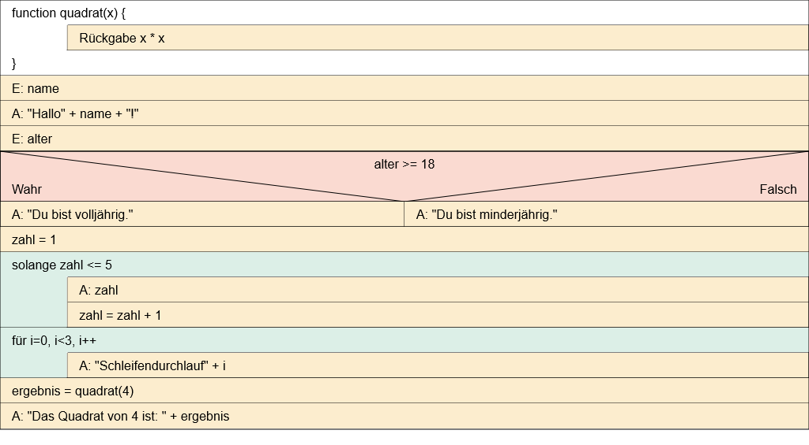
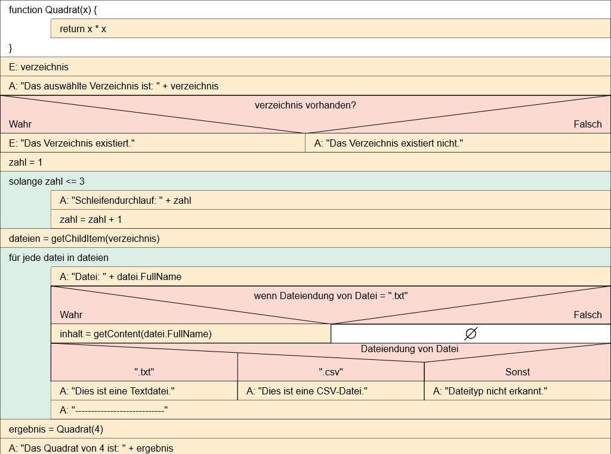

# Anwendungsentwicklung

## UML-Anwendungsfalldiagramme erstellen

## UML-Klassendiagramme erstellen

### Arbeitsauftrag - UML-Klassendiagramme erstellen

## Struktogramme zur Planung von Anwendungen nutzen

### Arbeitsauftrag - Struktogramme erstellen

#### Aufgabe 1

- **Anweisungen:**
  - Eingabe: Hier werden Daten eingegeben, sei es durch den Benutzer oder durch andere Teile des Programms.
  - Ausgabe: Hier erfolgt die Ausgabe von Daten in der Kommandozeile.
  - Standardanweisung: Eine einzelne Operation oder Aktion.
- **Schleifen:**
  - Zählergesteuerte Schleife: Sie wird verwendet, wenn die Anzahl der Schleifendurchläufe im Voraus bekannt ist.
  - Kopfgesteuerte Schleife: Eine Schleife, bei der die Bedingung am Anfang überprüft wird.
  - Fußgesteuerte Schleife: Die Bedingung wird am Ende der Schleife überprüft.
- **Kontrollstrukturen:**
  - Verzweigung: Je nach Bedingung wird der Programmfluss in zwei verschiedene Richtungen (Wahr oder Falsch) verzweigt.
  - Fallunterscheidung: Ähnlich wie Verzweigung, jedoch mit mehreren Bedingungen und verschiedenen Pfaden.
  - Try-Catch: Wird verwendet, um Ausnahmen oder Fehler zu behandeln. Der "Try"-Block enthält den auszuführenden Code, während der "Catch"-Block aufgerufen wird, wenn eine Ausnahme auftritt.
- **Funktionen:**
  - Sie repräsentieren einen separaten Abschnitt des Codes, der eine bestimmte Aufgabe erfüllt. Funktionen können Parameter enthalten, die als Eingabe dienen (sogeannte Übergabeparameter), und können Werte zurückgeben.

#### Aufgabe 2

**Ziel der Verwendung von Struktogrammen:**

Das Hauptziel der Verwendung von Struktogrammen liegt in der klaren und verständlichen Planung von Programmlogiken. Struktogramme bieten eine grafische Darstellung von Algorithmen und Programmen, die es ermöglicht, den Ablauf und die Struktur des Codes visuell zu erfassen. Durch die Verwendung dieser Notationsform soll die Entwicklung von Software effizienter und fehlerärmer gestaltet werden. Die wichtigsten Ziele sind:

1. **Klare Darstellung:** Struktogramme bieten eine klare und gut strukturierte Darstellung der Programmlogik, wodurch Entwickler leicht verstehen können, wie der Code funktionieren soll.
2. **Logische Strukturierung:** Die grafische Notation hilft dabei, die logische Struktur des Codes zu visualisieren, einschließlich Verzweigungen, Schleifen und Funktionen. Dies erleichtert die Planung und Organisation des Codes.
3. **Fehlervermeidung:** Durch die frühzeitige Visualisierung des Algorithmus können potenzielle Fehler oder Inkonsistenzen leichter erkannt und behoben werden, bevor der eigentliche Programmcode geschrieben wird.
4. **Kommunikation:** Struktogramme dienen als effektives Kommunikationsmittel zwischen Entwicklern, indem sie eine gemeinsame visuelle Sprache bieten. Teammitglieder können die Logik leichter besprechen und verstehen.

**Vor- und Nachteile von Struktogrammen:**

**Vorteile:**

1. **Klarheit und Verständlichkeit:** Die grafische Darstellung erleichtert das Verständnis der Programmlogik, sowohl für den Entwickler, der den Code erstellt, als auch für andere Teammitglieder.
2. **Fehlererkennung:** Durch die visuelle Darstellung können Fehler und Unstimmigkeiten in der Logik frühzeitig erkannt und behoben werden, was zur Verbesserung der Codequalität beiträgt.
3. **Planungshilfe:** Struktogramme dienen als nützliche Werkzeuge in der Planungsphase, indem sie Entwicklern helfen, den Algorithmus zu entwerfen, bevor der eigentliche Code geschrieben wird.
4. **Effektive Kommunikation:** Sie bieten eine gemeinsame Notation, die die Kommunikation zwischen Teammitgliedern erleichtert und Missverständnisse reduziert.

**Nachteile:**

1. **Begrenzte Detailtiefe:** Struktogramme können in komplexen Programmen manchmal an Detailtiefe verlieren, insbesondere wenn es um komplexe Datenstrukturen oder spezifische Implementierungsdetails geht.
2. **Nicht immer maschinenlesbar:** Struktogramme sind primär für den menschlichen Leser gedacht und werden nicht direkt von Computern interpretiert. Der eigentliche Programmcode muss separat geschrieben werden.
3. **Zeitaufwändig:** Das Erstellen detaillierter Struktogramme kann zeitaufwändig sein, insbesondere für umfangreiche Programme. In einigen Fällen kann dies als zusätzlicher Schritt wahrgenommen werden.
4. **Abstraktion:** Manchmal kann die Abstraktion in Struktogrammen zu einer gewissen Entfremdung von konkreten Code-Implementierungen führen, was für einige Entwickler eine Herausforderung darstellen könnte.

#### Aufgabe 3

#### Aufgabe 4

#### Aufgabe 5

